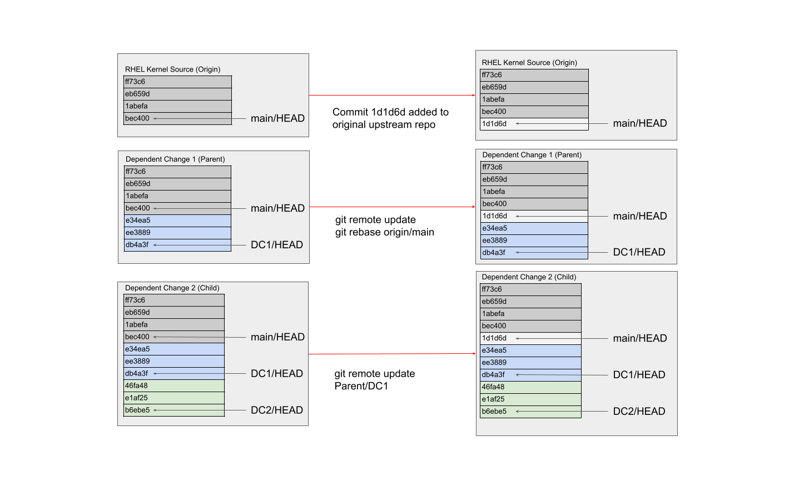

// Borrowed from https://github.com/asciidoctor/asciidoctor.org/issues/571
:caution-caption: pass:[☠]
:important-caption: pass:[❗]
:note-caption: pass:[🛈]
:tip-caption: pass:[💡]
:warning-caption: pass:[⚠]



https://red.ht/kwf_commit_rules[https://red.ht/kwf_commit_rules]

These are the Red Hat Kernel Engineering Guidelines and 'Best Practices' for commits and Merge Requests (MRs) Titles and Descriptions for the Red Hat Linux Kernels, aka “Commit Rules”.  Following these instructions will result in your changesets (aka Merge Requests) passing Red Hat’s commit verification webhooks, and reduce the number of questions from reviewers, submaintainers, and maintainers about your proposed changes.  If you have questions about this document or the procedure used to author changes, file an issue on the GitLab project that you are contributing to.

Following the upstream kernel patch guidelines will satisfy the general construction of commits, but there are additional rules specific to Red Hat to assist in changeset tracking, accounting, and reviewing.  Other than the differences noted in this document, following the upstream process is generally accepted as good practice.

https://redhat.gitlab.io/centos-stream/src/kernel/documentation/[Please ensure that you are familiar with the technical requirements.]

Red Hat uses GitLab to manage the patch workflow, and all changes must be submitted as GitLab merge requests.  Contributors can use the GitLab UI to submit merge requests.  Alternatively, tools such as xref:lab.adoc[lab] or xref:revumatic.adoc[revumatic] can be used to work with the merge requests.

== Alternative Code Submission Formats
Contributors may submit changesets in formats other than are detailed in this document.  Contributors using alternative code submission formats must obtain consensus with their reviewers, approvers, and maintainers on acceptance of the alternative format.  When submitting with an alternative format contributors may be asked for future commitments to security and z-stream fixes.

== Tag Format

Tags described below are accepted space separated or hyphen separated, with the first word capitalized or all words capitalized. For example, all of "Upstream status:", "Upstream Status:", "Upstream-status:" and "Upstream-Status:" are valid and must be recognized by the kernel-webhooks and custom tools.

== Use of the term "Upstream"

https://git.kernel.org/pub/scm/linux/kernel/git/torvalds/linux.git[Linus' linux.git] is considered to be the repository referred to when the term "upstream" is used.  All other repostiories and commit references are considered to be "not upstream".

== Example Commit Log

The following is an example of a valid commit title & description.  The first column lists the sections below which describe in detail what is needed:

[link:CommitRules.adoc#user-content-1-title[1]]  subsystem: include missing kernel.h header to fix compile +
[link:CommitRules.adoc#user-content-2a-jira-reference-required[2a]]  JIRA: <Jira reference> +
[link:CommitRules.adoc#user-content-2c-upstream-status-required[2c]]  Upstream Status: <if not linux.git provide upstream tree, or mark as RHEL specific> +
[link:CommitRules.adoc#user-content-2e-cve-reference-optional[2e]]  CVE: <CVE number if required> +
[link:CommitRules.adoc#user-content-2f-differences-from-the-upstream-patch-optional[2f]]   Conflicts: <if required> +
[link:CommitRules.adoc#user-content-2g-omitted-fixes-optional[2g]]   Omitted-fix: <commit ID if required> +
[link:CommitRules.adoc#user-content-2g-omitted-fixes-optional[2g]]                <omitted-fix explanation required> +
[link:CommitRules.adoc#user-content-2g-omitted-fixes-optional[2g]] +
[link:CommitRules.adoc#user-content-3-commit-specific-description-information[3]] commit 7fff4beb311dfab4f18ff2cd64f78scd9296a39a +
[link:CommitRules.adoc#user-content-3-commit-specific-description-information[3]]  Author: John Upstream <john.upstream@someupstreamplace.com> +
[link:CommitRules.adoc#user-content-3-commit-specific-description-information[3]]  Date:   Mon Mar 28 14:29:19 2011 -0700 +
[link:CommitRules.adoc#user-content-3-commit-specific-description-information[3]] +
[link:CommitRules.adoc#user-content-3-commit-specific-description-information[3]]     subsystem: include missing kernel.h header to fix compile +
[link:CommitRules.adoc#user-content-3-commit-specific-description-information[3]]     This is needed to compile this module.  It was missing from +
[link:CommitRules.adoc#user-content-3-commit-specific-description-information[3]]     the original commit. +
[link:CommitRules.adoc#user-content-3-commit-specific-description-information[3]] +
[link:CommitRules.adoc#user-content-3b-email-bridge-upstream-contributors-required[3b]]     Signed-off-by: John Upstream <john.upstream@someupstreamplace.com> +
[link:CommitRules.adoc#user-content-3b-email-bridge-upstream-contributors-required[3b]]     Signed-off-by: Jane Upstream <jane.upstream@someupstreamplace.com> +
[link:CommitRules.adoc#user-content-4-version-information-if-necessary[4]] +
[link:CommitRules.adoc#user-content-4-version-information-if-necessary[4]] v2: Some information about the changes between v1 and v2 +
[link:CommitRules.adoc#user-content-4-version-information-if-necessary[4]] +
[link:CommitRules.adoc#user-content-5-dco-signed-off-by-tag[5]] Signed-off-by: Shadow Man <shadow.man@redhat.com>

== Example Merge Request

The following is an example of a valid Merge Request title and description.  The first column lists the sections below which describe in detail what is needed:

[link:CommitRules.adoc#user-content-1-title[1]]  subsystem: a general explanation of the changeset

[link:CommitRules.adoc#user-content-2a-jira-reference-required[2a]]  JIRA: <Jira reference> +
[link:CommitRules.adoc#user-content-2b-testing-details-required[2b]]  Tested: <testing information> +
[link:CommitRules.adoc#user-content-2c-upstream-status-required[2c]]  Upstream Status: <if not linux.git provide upstream tree, or mark as RHEL specific> +
[link:CommitRules.adoc#user-content-2d-changeset-dependencies-optional[2d]]  Depends: <Jira reference if required> +
[link:CommitRules.adoc#user-content-2e-cve-reference-optional[2e]]  CVE: <CVE number if required> +
[link:CommitRules.adoc#user-content-2f-differences-from-the-upstream-patch-optional[2f]]   Conflicts: <if required> +
[link:CommitRules.adoc#user-content-2g-omitted-fixes-optional[2g]]   Omitted-fix: <commit ID if required> +
[link:CommitRules.adoc#user-content-2g-omitted-fixes-optional[2g]]                <omitted-fix explanation required> +
[link:CommitRules.adoc#user-content-2g-omitted-fixes-optional[2g]] +
[link:CommitRules.adoc#user-content-3-commit-specific-description-information[3]]  An explanation of what the problem the changeset resolves, how the changeset +
[link:CommitRules.adoc#user-content-3-commit-specific-description-information[3]]  resolves the problem, additional testing details, etc.   +
[link:CommitRules.adoc#user-content-3-commit-specific-description-information[3]] +
[link:CommitRules.adoc#user-content-4-version-information-if-necessary[4]]  v2: Some information about the changes between v1 and v2 +
[link:CommitRules.adoc#user-content-4-version-information-if-necessary[4]] +
[link:CommitRules.adoc#user-content-5-dco-signed-off-by-tag[5]] Signed-off-by: Shadow Man <shadow.man@redhat.com> +
[link:CommitRules.adoc#user-content-6-internal-contributors[6]] Cc: Fedora Friend <fedora.friend@redhat.com>

=== Section Descriptions

The following sections provide the format that developers should follow in order to help both engineers review changesets and maintainers process commits and MRs as quickly and as efficiently as possible.

==== 1. Title
For commits, use the upstream commit title.  In general, for Merge Requests, use the upstream format of <arch,subsystem>: 
.  Copying upstream commit subject lines is acceptable and commonplace; however, the title should attempt to capture what the commit does and not what the commit fixes.  Not all upstream summaries are sufficient; for example “treewide” commits may be altered to indicate the specific section of code they are modifying.

Commits that are unique to RHEL (commonly referred to as RHEL-only commits) in a changeset must have a unique commit description that identifies it from other commits.  Duplicate commit titles usually cause confusion for reviewers and maintainers alike. As is the case with upstream, the title must contain a descriptive explanation of the entire changeset.

===== 1a.  z-stream Merge Request Title
In addition to the requirements in link:CommitRules.adoc#user-content-1-title[section 1], z-stream Merge Request titles should be appended with the targeted z-stream name in square brackets.  For example,

	A Merge Request Title [rhel-8.2.z]
	Another Merge Request Title [rhel-8.3.z]

Additional metadata, such as the Jira ID or CVE ID, should be included in the Merge Request description and not the title.

====  2. Description
In order to handle and prioritize the large number of MRs submitted to the Red Hat Kernel project, the description must contain metadata necessary to assist in integrating changesets into official kernel releases.  The metadata section contains a required Jira reference, testing details, and some additional metadata that may be required depending on the circumstances surrounding the commit or MR.

===== 2a. Jira Reference (required)
Each commit in a changeset and the MR description must reference at least one Red Hat Jira URL on a line beginning with “JIRA: https://issues.redhat.com/browse/RHEL-<ID>” (where <ID> is a valid number).  If the MR resolves multiple jiras, the description must include only one jira URL per “JIRA:” line.  *Jira IDs (ie, just a tag & number) are not acceptable*.

Changesets that are lacking a Jira will not be committed and will be immediately flagged by the project’s webhooks.  Every changeset needs to be coordinated with other groups at Red Hat(management, QE, Documentation, etc.) and the coordination is handled through Jira fields and state.

The INTERNAL keyword can be substituted for a Jira URL.  The INTERNAL keyword indicates a change to code that is considered to have minimal customer impact such as changes to files in the redhat directory (excluding CONFIG* files) or the .gitlab-ci.yaml file.

Good examples for Jira URLS in the description:

    JIRA: https://issues.redhat.com/browse/RHEL-1559
    JIRA: INTERNAL

===== 2b. Testing Details (required)
The MR description must include information about how the changeset was tested.  This information can include links to test results in a Jira or a text description of the results.

===== 2c. Upstream Status (required for commits not in upstream tree)
If the upstream source tree is not linux.git, the description must include a URL, a git:// address, or a git+ssh address for the upstream source tree.  Commits with an identified source must also specify a link:CommitRules.adoc#user-content-3a-commit-sha1-format-required[commit sha1] in their description.

If the changeset is not in Linus' linux.git tree, please specify the URL of the source tree, a URL to the patch posting on a mailing list, or explain why the changeset is unique to RHEL.

Non-upstream change tracking is useful for Engineering teams monitoring current, future, and update releases, therefore changesets that are not in an upstream tree and are unique to RHEL must have upstream status in the format "RHELX.Y.Z only".  "RHEL only" must be used for changesets that must be applied to future versions of RHEL.  Changes that will only be applied to a specific major release must have status "RHELX only", and changesets in a minor release that are temporary workarounds must be specified in the format "RHELX.Y only". Temporary workaround changesets can also include additional information about future work in parenthesis.  Unique z-stream fixes must be specified with upstream status as "RHELX.Y.Z only".  This follows the Tag Format described above, making "RHEL-Only" and similar forms acceptable, too.

Changes that have been sent upstream but have not been included in an upstream repo must have status “Posted” followed by a link to the upstream post, merge request, or pull request.

Critical undisclosed information security issues, or unreleased critical CVEs, may also use "Upstream Status: Embargoed".

Good examples of Upstream Status for changesets that are not in Linus’ linux.git:

    Upstream Status: https://git.kernel.org/pub/scm/linux/kernel/git/next/linux-next.git
    Upstream Status: git://git.kernel.org/pub/scm/linux/kernel/git/torvalds/linux.git
    Upstream Status: git@gitlab.com:redhat/centos-stream/src/kernel/centos-stream-9.git
    Upstream Status: RHEL only
    Upstream Status: RHEL-only
    Upstream Status: RHEL Only
    Upstream Status: RHEL-Only
    Upstream Status: RHEL8.1 only (to be removed in RHEL-1559)
    Upstream Status: Posted https://lore.kernel.org/lkml/87ft4djtyp.fsf@nanos.tec.linutronix.de/
    Upstream-status: RHEL8.6 only
    Upstream Status: RHEL9 only
    Upstream Status: Embargoed (to be released in 5.16)

Red Hat's automated tooling attempts to do basic validation of upstream git tree references, currently accepting URLs starting with:

* git://anongit.freedesktop.org/
* https://anongit.freedesktop.org/git/
* git://git.kernel.org/pub/scm/
* https://git.kernel.org/pub/scm/
* git://linux-nfs.org/
* http://git.linux-nfs.org/
* git://git.infradead.org/
* https://github.com/
* https://git.samba.org/

====== Identifying changes to the redhat/ directory

The upstream location for redhat/ changes is the https://gitlab.com/cki-project/kernel-ark[the Fedora/ARK kernel(aka, kernel-ark)] project on the os-build branch.  Changes to the redhat/ directory for downstream Red Hat kernel projects must either be a backport from the kernel-ark project, or must include a detailed explanation of why the change does not apply to kernel-ark.

The Upstream Status policy outlined in the above section also applies to redhat/ changes.  Valid example for a kernel-ark backport are:

    Upstream Status: RHEL only, https://gitlab.com/cki-project/kernel-ark
    Upstream Status: https://gitlab.com/cki-project/kernel-ark

===== 2d. Changeset Dependencies (optional)
If your changeset depends on another changeset being accepted and merged first, then you need to make sure that the description of your MR contains a reference to the dependent change.

For each dependency, your description must contain a unique line starting with `Depends:`.  The content after the keyword should be a specific URL pointing at another MR in the same project.

NOTE: Additional syntax is allowed, such as a Jira link, but the functionality may be limited to only a MR URL in the future.

When assembling the commits on your dependent changeset, you must make sure that the changes for your MR are layered over the dependent changes as displayed in the graphic below.  Dependencies, as the name implies, must precede all changes from the submitted set.  The webhooks rely on ordering to identify the last commit that is part of your changeset and the first commit of a dependency chagneset, and will stop walking the commit list when reaching the first dependency commit.  Dependencies intermingled with your changes will not be properly evaluated by the webhooks.

In the event of a conflicting change from either the parent repository or the upstream (aka `origin`) repository, you will need to make sure to rebase your changes in order from eldest to youngest.  For example, in the above graphics, a new commit was added to the upstream repository (commit `1d1d6d`).  You will need to make sure that `Dependent Change 1` (aka `parent`) is rebased on `origin`, and then you can rebase `Dependent Change 2` (aka `child`) on `Dependent Change 1` (aka `parent`).  This pattern needs to be repeated for every level of dependency in the chain.

IMPORTANT: Careful coordination should be used when working with dependencies.  You shouldn't post a changeset that has a dependency against something that hasn't already been posted itself.  Similarly, a dependent change cannot be merged until the parent itself has been merged *first*.  It is very easy for the various pieces of the chain to become out of sync with each other.

===== 2e. CVE Reference (optional)
If the changeset resolves a Jira that has an associated CVE number, each commit in the changeset and the MR description must include the CVE reference ID.  Use one “CVE:” line for each CVE that the changeset resolves, and include the number as described in the Jira, e.g "CVE-YYYY-XXXXX".

Unreleased critical CVEs can use link:CommitRules.adoc#user-content-2c-upstream-status-required["Upstream Status: Embargoed"] in place of referencing an upstream commit ID.

===== 2f. Differences from the upstream patch (optional)
If the commit differs from the original upstream commit, a short description of the differences should be included on a line that begins with “Conflicts:”.  Simple patch conflicts like fuzz do not need to be documented.

===== 2g. Omitted Fixes (optional)
If there is a subsequent upstream commit with any reference to the backported commit which is not included in the changeset it should be included on a line that begins with "Omitted-fix:".  The "Omitted-fix:" line should include a minimum 12-character commit ID and the title of the omitted fix.  The following line(s) must include a reason for omitting the fix.

The use of the "Omitted-Fix:" tag does not imply the decision to omit the fix is correct.  The usage of the tag only means the author has chosen to omit that particular fix from their changeset.  Reviewers must take care to confirm the decision to omit these commits is correct.

Good examples of omitted fixes:

    Omitted-fix: abcdef123456 ("some subject")
                 Patched code is not present in RHEL.  With some
                 additional reasons.

    Omitted-fix: fedcba654321 ("another subject")
                 Patched code is not enabled in RHEL

====  anchor:commitdescriptioninfo[] 3. Commit-Specific Description Information
_Only commits and __single-commit MR__s must include the information in this section._

A detailed changelog is required for all changes made to the Red Hat Kernel sources.  The maintainers and reviewers do not allow empty commits or MR descriptions.

Commits and single-commit MRs must include the commit hash, author, upstream commit date, upstream title, and upstream commit message in the MR description.  An example of the format of the output is provided in the introduction section above.  The Red Hat recommended https://gitlab.com/redhat/centos-stream/src/kernel/utils/tools/-/blob/main/git-backport[git-backport] command replicates the format.  Contributors using https://git-scm.com/docs/git-cherry-pick[git-cherry-pick] must use the git-commit command’s --reset-author option to avoid link:commit_attribution_policy.adoc[false attributions of commits], and modify email 'Cc:' lines[link:CommitRules.adoc#user-content-3b-email-bridge-upstream-contributors-required[3b]].

Reviewers prefer to have the *entire* commit message as it appears upstream, including Cc’s and sign-offs.  'git show'-style indentation of the original upstream commit message helps distinguish the commit message from any additional comments that are added.  Many reviewers use the upstream commit message and sign-off details as a measure of how reliable a commit is.

Do not include local commit IDs in changeset submissions.  These only confuse reviewers, as reviewers don't have access to the originating trees.  MRs that include local commit IDs will be blocked by webhooks.

===== 3a. “commit” sha1 format (required)
Red Hat follows an “upstream-first” philosophy, so commits with an link:CommitRules.adoc#user-content-2c-upstream-status-required[Upstream Status] that identify them as originating from an external tree must specify the git sha1 ID.  Red Hat Kernel project’s tools parse the commit sha1 for analysis, so *the format of the git sha1 ID is strictly enforced*.

The upstream sha1 ID must be referenced using one of these three formats (pick one that suits better your workflow):

commit <full sha1 hash> +
commit <full sha1 hash> (<branch name>) +
(cherry picked from commit <full sha1 hash>)

The commit line starts at the first column (no whitespace at front is allowed) and is followed by a new line.  To be precise, the following Perl regex must be able to match:

    ^commit ([0-9a-f]{40})( \(.*\))?$|^\(cherry picked from commit ([0-9a-f]{40})\)$

===== 3b. Email Bridge & Upstream contributors (required)
Upstream contributors Cc’s, Signed-off-by:, and other tags must be shifted right by 4 spaces to avoid the email bridge erroneously cc’ing non-redhat.com email addresses.

==== 4. Version Information (if necessary)
If the changeset has been updated, the Merge Request Description, and the updated commits must contain information on the changes.

Minor modifications to an existing MR comment are allowed.  A minor modification can be defined mostly as correcting a typo or adjusting the language of a sentence that is otherwise unclear (i.e. perhaps there's a word missing).  It is important to keep comments as close to their original intent as possible since they are used for auditing purposes.

==== 5. DCO & Signed-off-by Tag
A "Signed-off-by:" tag on each commit of a changeset is required on all commits and MR descriptions.  This sign-off must be completed using your redhat.com email address.

The Linux Kernel Community has required an acknowledgement of the Developer's Certificate of Origin (DCO), https://www.developercertificate.org[https://www.developercertificate.org], for many years.  The DCO is a way of handling contributions to an open source project in which each contribution is associated with a certification signifying that the contributor has the right to submit the contribution under +
the applicable open source license of the project.

Contributions made to the Red Hat kernel must acknowledge the DCO with the use of a "Signed-off-by:" tag from your redhat.com email address.  The tag must start at the beginning of a new line.  For example,

[source]
----
         Signed-off-by: Shadow Man <shadow.man@redhat.com>
----

is NOT acceptable.  The proper tag usage requires the Sign-off start at the beginning of a new line,

[source]
----
Signed-off-by: Shadow Man <shadow.man@redhat.com>
----

Contributors must add a Signed-off-by: tag regardless of having signed-off on the original upstream commit.

==== 6. Internal Contributors
Internal “Cc:” or additional “Signed-off-by” tags can be added at the end of the merge request description.  The GitLab Email Bridge will cc email addresses in the MR description.

