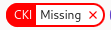
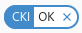
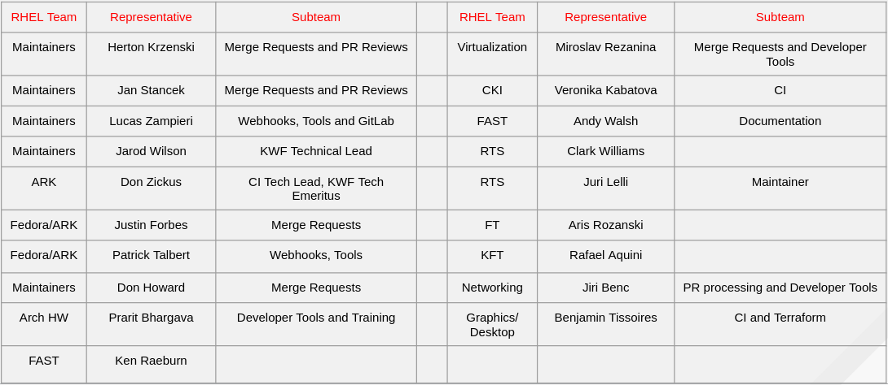
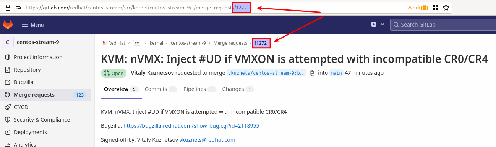
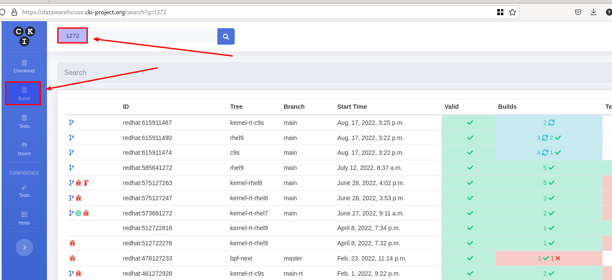
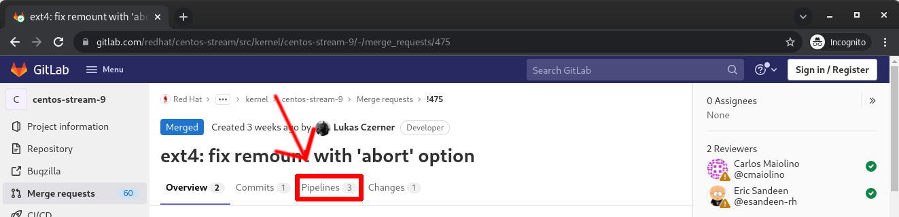
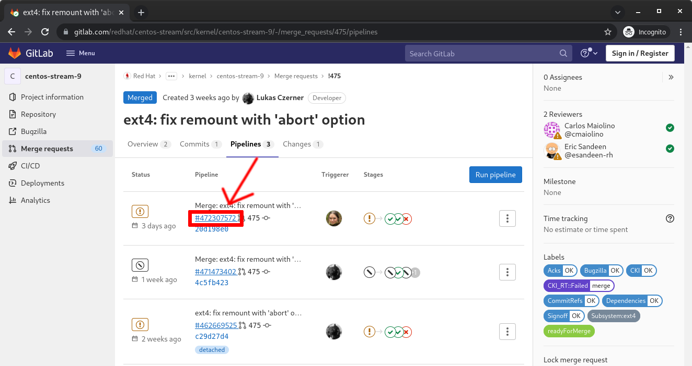

= Frequently Asked Questions

The most common questions related to contributing to Red Hat-based kernel projects.

:sectnums:



== Formatting Related Questions
:sectnums:
=== anchor:badformatting[] The formatting is bad, how do I fix it?
:sectnums:
.. Descriptions and comments utilize https://docs.gitlab.com/ee/user/markdown.html[GitLab Flavored Markdown] to handle the formatting of the text.
.. Consecutive lines separated by single newlines, without a blank line in between, will be treated as a paragraph for purposes of display. The MR tools will still see the newlines and will treat such labeled fields (“JIRA:”, etc) as intended. If you want a cleaner display, insert a blank line between entries.
.. Indented blocks of text get a box around them, which can cause unintended consequences on the formatting of the display of your description..

== Label Related Questions
:sectnums:
=== I have a red `Unmet Requirement` label , what does this mean and how do I fix it?
:sectnums:
.. Review the listed Dependencies in the MR Summary.
.. Find each of the MR associated with the Dependencies line(s)
.. Compare the common commits between this MR and each of the dependent MR commits.
... If any of the common commits have *different* ID's, the Dependency check will be marked as RED.
... To resolve, this MR must be rebased upon the tree containing the mismatched commit ID.
=== I opened a new MR, but there is a  Label.  What is the problem?
:sectnums:
.. First, confirm whether you can see a Pipelines tab on the MR itself.
... Try to REMOVE the  label.  This will trigger the system to re-run the webhook and will likely return as  if the test ran OK but the webhook hasn't posted the update yet.
... If the  label returns, go into the Pipelines tab and press the  button.  That will generate some results that should satisfy the unmet requirement.
.. If the Pipelines tab is missing:
... A possible cause is that the source branch (on your fork) is named `main`.  The name `main` is protected and is not able to trigger a pipeline job.  To resolve this, close the current MR, rename the branch on your fork and open a new MR.
... Another possible cause is that you have insufficient permissions.  Find another associate in your organization that can look to confirm whether they see the missing tab (and  button on that tab)
.... If they can see it, ask them to click the  button and then refer to <<weirdmr,My MR is behaving weirdly, I'm not sure what to do...>>

=== What does  indicate?
:sectnums:
.. This is currently only an informational alert.  It does not have an impact on the ability of an MR to be merged.
... https://cki-project.org/docs/user_docs/gitlab-mr-testing/full_picture/#blocking-on-missing-targeted-testing[This is intended to transition to a blocking tag in the future], but there are no timelines attached to this effort currently.
.. It is currently consumed by QA teams that are working on identifying testing gaps.  The label indicates that the changed code in this commit did not have any specific tests that target the affected area.  Baseline testing (booting, functional, standard regression, etc.) is still performed and validated.

=== What does  indicate?
:sectnums:
.. This label indicates that the Merge Request has been identified by the Networking Team as requiring additional testing.  Questions on network testing can be sent to mailto:kernel-net-submaint@redhat.com[kernel-net-submaint@redhat.com].

== MR Interactions
:sectnums:
=== How do I make the webhook re-evaluate the readiness of a MR?
:sectnums:
.. Remove the label you want re-checked by clicking the 'x' in the Labels area as defined above under step 8.  (i.e. if you have , remove that label from the MR)

=== The link I received to create the MR for my change only refers to my fork and not the upstream kernel tree. Why did this happen and how do I resolve it?
:sectnums:
.. This typically happens if you have inadvertently cloned your fork and the `origin` remote points at your fork rather than the upstream tree.
.. It is recommended that you clone the upstream tree, not your fork. +
If that is not an option, then you can specify the remote to use when creating the MR. +
_(https://groups.google.com/a/redhat.com/g/kernel-info/c/B0cUCO8IoIY/m/F0_GGO0zAQAJ[reported on kernel-info].)_

=== anchor:commonformattingissues[] I followed the commit rules as detailed, why do I have a red label that is seemingly satisfied? +
:sectnums:
Things to be aware of:
... Even extra leading whitespace can cause problems, and may not be obvious in some browsers.
.... https://gitlab.com/redhat/centos-stream/src/kernel/centos-stream-9/-/merge_requests/141[https://gitlab.com/redhat/centos-stream/src/kernel/centos-stream-9/-/merge_requests/141] shows an example where fields were indented but not rendered as such.
... Beware that some formatting is masked by the web interface that can only be seen via the edit interface. (for example, the <>'s around an email address in the DCO sign-off)
.... https://gitlab.com/redhat/rhel/src/kernel/rhel-8/-/merge_requests/1720[https://gitlab.com/redhat/rhel/src/kernel/rhel-8/-/merge_requests/1720] shows an example of this.

=== anchor:weirdmr[] My MR is behaving weirdly, I'm not sure what to do...
:sectnums:
.. First and foremost, make sure to click the https://red.ht/GitLabSSO[GitLabSSO link] to refresh your permissions.
.. Reach out to your KWF Representative for assistance.
+


.. Send an email to mailto:kernel-info@redhat.com[kernel-info@redhat.com].
.. If there's a GitLab specific issue, you can open an issue at https://gitlab.com/redhat/rhel/src/kernel/bugreports[Red Hat Kernel bug reports].

=== How can I determine the status of any related Jiras on my MR?
:sectnums:
.. The jira webhook will post a comment to the MR with the current status of each referenced ticket.  Each time the webhook is run, that comment will be edited to reflect the current state.

=== Can I edit my comments?
:sectnums:
.. Minor modifications to an existing MR comment are allowed.
.. A minor modiviation can be defined mostly as correcting a typo or adjusting the language of a sentence that is otherwise unclear (i.e. perhaps there's a word missing).
.. *It is important to keep comments as close to their original intent as possible since they are used for auditing purposes.*

=== anchor:getartifactsdirectly[] How do I get build artifacts without looking at Jira? +
:sectnums:
.. Search by Merge Request ID.
+

.. Navigate to the https://datawarehouse.cki-project.org/[CKI Datawarehouse] tab and search for the `Merge Request ID`.
+


**It is possible to search by a pipeline ID.**

.. Find the pipelines tab  and click it
.. Find the most recent build and click the pipeline number +
+


=== When I attempt to click the new Merge Request link after a push, I get an error.  How do I resolve it? +
:sectnums:

Occasionally, when clicking the link that is provided after a `git push`, the browser page that opens returns an HTTP 500 error.

```
   500
   Whoops, something went wrong on our end.
   Request ID: 01GQ0QHBS01AZNMPGYFC0JBEG9

   Try refreshing the page, or going back and attempting the action again.

   Please contact your GitLab administrator if this problem persists.
```

This is caused by an issue on the GitLab server side.  Try the following steps to resolve or work around the problem:

. Retry after a few minutes. (Try this step a couple of times before moving on)
.. Sometimes it can just be a transient problem and waiting 5-10 minutes may be enough to fix the problem.
. Consider opening a https://gitlab.com/redhat/rhel/gitlab#user-content-service-issues[support ticket] with GitLab.
. Work around the problem by using xref:lab.adoc[the lab utility] or https://gitlab.com/gitlab-org/cli[gitlab-cli].

=== Why is GitLab asking for credit card information in my MR?

Pipelines are trying to run in your personal namespace. This can have various reasons:

- You have submitted a merge request against your own fork instead of the gitlab.com/redhat namespace. You can resolve this by resubmitting the merge request against the correct target project.
- You have used a source branch name that is protected *in the target project*, for example, 'main'.  You can resolve this by resubmitting your merge request from a source branch that does not match any of the protected branches of the target project.
