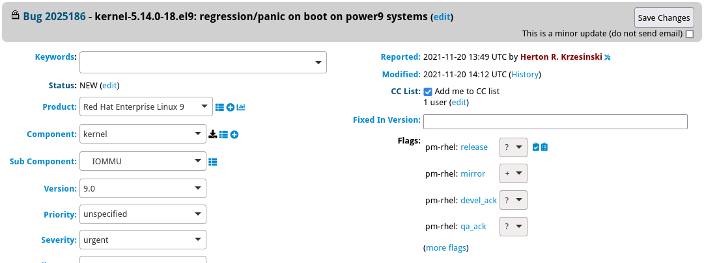
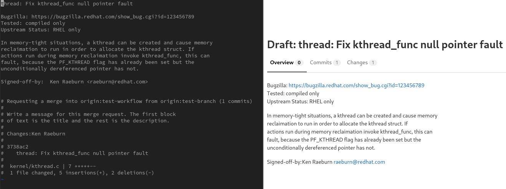
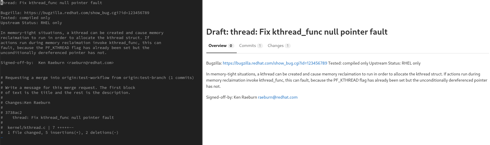
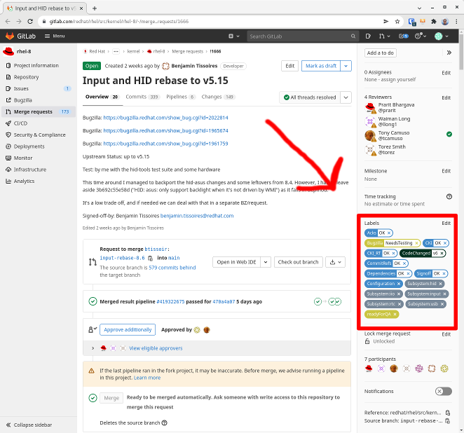
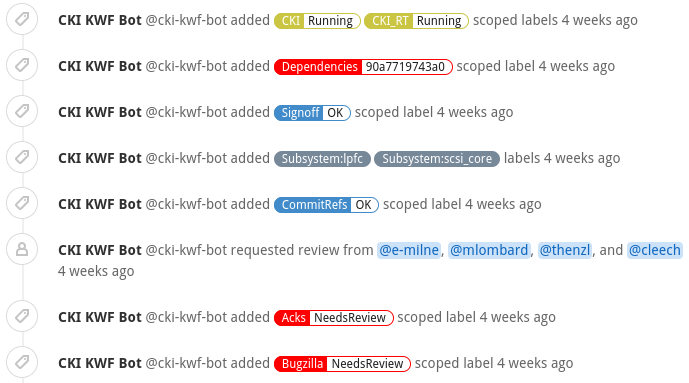
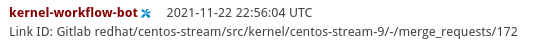
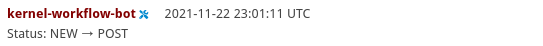
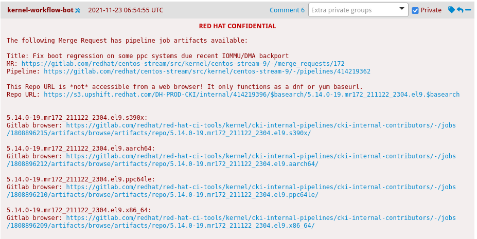
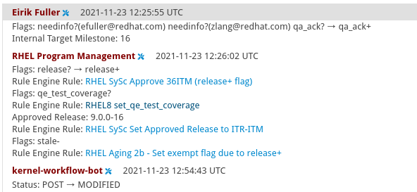
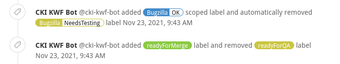

= Getting started with the RHEL kernel workflow
// Borrowed from https://github.com/asciidoctor/asciidoctor.org/issues/571
:caution-caption: pass:[☠]
:important-caption: pass:[❗]
:note-caption: pass:[🛈]
:tip-caption: pass:[💡]
:warning-caption: pass:[⚠]



This document aims to help you quickly get started with contributing to the Red Hat-based kernel projects including https://gitlab.com/redhat/rhel/src/kernel[RHEL kernels], https://gitlab.com/centos-stream/src/kernel[CentOS Stream kernels], and https://gitlab.com/cki-project/kernel-ark[the Fedora/ARK kernel].

https://redhat.gitlab.io/centos-stream/src/kernel/documentation/[Please ensure that you are familiar with the technical requirements.]

The target audience of this document is a Red Hat Kernel Developer or Partner Engineer. +
[.small]_Instructions for External Contributors will be provided in a separate document._

Looking for the xref:faq.adoc[FAQ?]

== Preparing to contribute for RHEL kernel

=== Configuring Bugzilla and GitLab accounts

* Create and configure your https://bugzilla.redhat.com/createaccount.cgi[Red Hat Bugzilla account].
.. Red Hat Developers must be a member of the `redhat` bugzilla group to properly associate their account with GitLab.
.. Red Hat Partner Engineers must be a member of `redhat_partner_engineer_staff` to properly associate their account with GitLab.
+
xref:rh_and_gitlab_configuration.adoc#partnerengineer[Required Permissions for Red Hat Partner Engineers] +
[.small]_Look for "I'm using https://red.ht/GitLabSSO to login to GitLab and can see centos-stream and other public projects but cannot see the RHEL projects."_
+
https://redhat.service-now.com/help?id=kb_article_view&sysparm_article=KB0009257[Instructions to Request Access]
* Create and configure your https://gitlab.com/users/sign_up[GitLab account] per the  xref:rh_and_gitlab_configuration.adoc#accountcreation[Red Hat and GitLab Configuration Guide]
.. xref:rh_and_gitlab_configuration.adoc#sshconfiguration[Configure your SSH keys] to your GitLab account.
.. xref:rh_and_gitlab_configuration.adoc#tokens[Create a Personal Access Token (PAT)] as a means or authentication for your GitLab account. This token is required to use any of the recommended public tools for kernel work.
* Associate your Red Hat and GitLab accounts together: https://red.ht/GitLabSSO +
This link should be used when starting fresh, or when common issues such as these occur:
** A contributor is experiencing difficulties such as (but not limited to) restricted access to repositories. +
** Pipelines not running. +
+
NOTE: It is recommended to renew the SSO association on a regular basis (monthly or quarterly) as it can expire and cause unintended behavior. +
_This does not apply to External Contributors.  Instructions will be provide in a separate document._

=== Utilities
Install and configure your utilities for performing contributor and reviewer actions. +
You can choose from: +

* Internal Tools:
** https://gitlab.com/prarit/rhstatus[rhstatus] - Provides a terminal based report based on the current status of a developer's TODO list and open Merge Requests.
* External Tools:
** https://gitlab.com/redhat/centos-stream/src/kernel/utils/revumatic/[revumatic] - A review tool that provides a text user interface to review GitLab Merge Requests.
** xref:lab.adoc[lab] - Interact with repositories on GitLab (creating/editing Merge Requests, forking projects, etc.) via command line.
+
IMPORTANT: We recommend using the `lab` utility to create forks and subsequent MRs to provide a consistent experience. Proceeding with this document assumes that `lab` is configured.

=== Notable Red Hat projects

** https://red.ht/GitLab[Main Red Hat RHEL namespace]
** https://gitlab.com/redhat/rhel/src/kernel/rhel-8[Private rhel-8 kernel source]
** https://gitlab.com/redhat/centos-stream/src/kernel/centos-stream-9[Public centos-stream-9 kernel source (You want to contribute here!)]
** https://gitlab.com/redhat/rhel/src/kernel/rhel-9[Private rhel-9 z-stream/EUS contribution kernel source]

=== Createing a Bugzilla ticket

* Select the appropriate release in the product and version fields. +
_For example, for RHEL 9:_ +
*Product*: Red Hat Enterprise Linux 9 +
*Version*: 9.0 +
*Component*: kernel +
*Sub Component*: select the suitable one or select “other” if there is no such one.
+

=== anchor:getreleaseapproval[] Get release approval

_This does not apply to External Contributors_

.. http://pkgs.devel.redhat.com/rules.html[Requirements for release+ can be found here.] +
_Example: RHEL8.6 search for rhel-8.6.0_ +
_Example: c9s (for RHEL9 bugzillas)_
.. GENERAL GUIDANCE on how to obtain +release++ on a BZ: +
_(This guidance may vary and/or change down the road)_
... Before ITM 26: +
`ITR, DTM, ITM, devel_ack+, qa_ack+ = release+`
... After ITM 26: +
Same requirements, but also `exception+` or `blocker+` based on schedule.

=== Clone, fork and push
. Clone the project you want to contribute to. +
`git clone _<project_SSH_URL>_`
* *RHEL9*:
According to the https://gitlab.com/redhat/rhel/src/kernel/internal-docs/-/blob/main/CentOS-Stream-9_Workflow.adoc#user-content-red-hat-contributors[CentOS-Stream-9 Workflow document], use https://gitlab.com/redhat/centos-stream/src/kernel/centos-stream-9[CentOS-Stream 9] like a normal RHEL git tree for all development work per the http://red.ht/kernel_workflow_doc[kernel workflow] document. Working after ITM 26 may require additional considerations as specified for <<getreleaseapproval,obtaining release approval>> as well as working on an https://gitlab.com/redhat/rhel/src/kernel/rhel-9[internal RHEL-9 tree] instead.
* *RHEL8*:
Use https://gitlab.com/redhat/rhel/src/kernel/rhel-8[rhel8-tree] like a normal RHEL git tree for all development work per the http://red.ht/kernel_workflow_doc[kernel workflow] document. 
* Embargoed/NDA related content:
Contact the https://gitlab.com/redhat/centos-stream/src/kernel/documentation/-/blob/main/info/CODEOWNERS[relevant kernel maintainer].
+
IMPORTANT: For embargoed content or for content with non-disclosure agreements, you need to clone the project's kernel-private tree directly. You cannot create your own fork from it, because your code would end up in a personal fork. This would increase the possibility of it leaking to the public.
. Change directory to the project you cloned and use the +lab+ utility to fork the project.
* `lab fork` +
Note that kernel repositories take a long time to fork.
. Find the name of the fork.
* `git remote -v | grep _<GitLab_username>_` +
Note that GitLab username is used for the remote name.
. Modify your fork while following the details outlined in link:CommitRules.adoc#commitdescriptioninfo[Commit Rules Section 3: Commit-Specific Description Information]

. Push the updated branch to your kernel fork on GitLab.
* `git push -u _<GitLab_fork_name>_ _<branch_name>_`

== Creating merge requests

Familiarize yourself with link:CommitRules.adoc[Commit Rules] and xref:verifying_a_gitlab_mr.adoc[Verify the MR information] documents.

*Creating a merge request draft*

When done with your work, create a merge request (MR) on some branch other than the `main` branch. +
`git checkout -b <branch_name>` +
`# do your work` +
`git push -u _<GitLab_username>_ _<branch_name>_` +
`lab mr create --remove-source-branch --draft --force-linebreak _[<origin>]_` +

_Note that the previous command produces a MR URL that contains a MR ID._

We strongly recommend that users of the `lab` utility use the `--draft` option to verify the changes pass the https://gitlab.com/cki-project/kernel-webhooks/[kernel project's webhooks]. +
To achieve “optimal” formatting of the MR overview text, it is recommended that you use the `--force-linebreak` option with the `lab` utility. +

Here are a couple of examples with the same input template

with `--force-linebreak`:

and without `--force-linebreak`:

*Some tips*

If you choose to use Markdown, some common formatting problems can be found and addressed in xref:faq.adoc#commonformattingissues[FAQ "I followed the commit rules as detailed, why do I have a red label that is seemingly satisfied?"] and xref:faq.adoc#badformatting[FAQ "The formatting is bad, how do I fix it?"].

While editing the MR description, if you decide you don't want to create it just yet, exiting the editor with a non-zero return value (e.g. vim's `:cq`), or saving an empty file for the MR description will cause `lab` to abort the MR creation. +

=== MR status

For a MR to be approved and subsequently merged, it must meet certain requirements. The label panel on the right shows the current status. For example:

==== Label Color Descriptions

|===
|*Color*|*Description*|*Example*

|Red|Unsatisfied or Failed requirement a|
image::images/qsg-label_image-red.png[]

|Blue|Satisfied requirement a|

|Purple|Irrelevant requirement (will not prevent a merge) a|

|Gray|Informational, does not prevent a merge a|

|Goldenrod|Follow up on merge request a|

|Dark Green|Informational, Does not prevent a merge a|

|Light Green|Proceed to next steps a|

|===

The full list of possible labels is https://gitlab.com/cki-project/kernel-webhooks/-/blob/main/utils/labels.yaml[available for reference]. +

As various automated bot jobs run, different labels will be added or removed based on analysis of the MR or BZ or the results of tests performed: +

_If you don't like the relative timestamps, they can be turned off (changed to date+time) in your GitLab preferences._

=== Bugzilla ticket status

.. The CKI KWF Bot updates Bugzillas when applicable. +
Some examples include:
... When a BZ is detected in an MR, it automatically adds the link to the BZ.
+

... When a BZ is detected in an MR that contains code changes AND that BZ is in state NEW or ASSIGNED, the bot sets the status of that BZ to POST.
+

... When the CI pipeline has build products available such as kernel RPMs, the bot records them in the BZ as a private comment. +
+
NOTE: Since the comments are private, these links are not easily found for external contributors.  See xref:faq.adoc#getartifactsdirectly[FAQ "How do I get build artifacts without looking at Bugzilla?"]
+

... When a BZ has met (Ready for QA or Ready for Merge) requirements, the bot updates the BZ status to MODIFIED from POST.
+

... etc.
.. CKI Gating tests run in a pipeline automatically +
+
NOTE: If a CKI test fails, you should check https://cki-project.org/docs/user_docs/gitlab-mr-testing/faq/#a-test-failed-and-i-dont-understand-why[CKI test debugging FAQ]. If you're new to CKI start at the https://cki-project.org/docs/user_docs/gitlab-mr-testing/faq/#steps-for-developers-to-follow-to-get-a-green-check-mark[generic guide] which has further pointers. +
_If you encounter a failed test that results in a new purple label “CKI_RT::Failed:merge”, this can be ignored._ +

=== Submitting MR

. Once your MR has passed the initial webhooks checks and is ready for review by others, move it out of `draft` state. +
`lab mr edit <mrID> --ready` +
+
Three people need to ACK (or approve) this MR for it to pass. Direct action could be required to get people to provide their acks. +
+
When MR is approved, it receives the  label.
+

All approved MR's, assuming they have the +readyForMerge+ label, will normally be merged into the parent tree at the end of each week.

. xref:create-a-merge-request-for-zstream.adoc[Create MR targeting a specific branch (i.e. z-stream)]

== Performing additional operations on merge requests

=== Checking out and viewing

* Get a list of MRs.
** `git fetch --all` +
`lab mr list --all`

* Checkout the code from an MR.
** `git fetch --all` +
`lab mr list --all` # to find the mrID +
`lab mr checkout _<mrID>_`

* Get patches from an MR.
** `git fetch --all` +
`lab mr checkout _<mrID>_` +
`git-format-patch -_<number_of_patches>_` +
+
-or-
** `git-format-patch origin/main`

* View the code without checkout.
** `lab mr show --patch`

* Show comments on an MR.
** `lab mr show <mrID> --comments`

=== Performing actions

* Comment on an MR.
** Non-blocking
*** `lab mr comment _<mrID>_`

** Blocking (NACK)
*** `lab mr discussion _<mrID>_`
*** `lab mr reply _<mrID>:<comment_id>_`

* Approve an MR.
** `lab mr approve _<mrID>_`

* Unapprove an MR (Rescind-Acked-by).
** `lab mr unapprove _<mrID>_`

* Close an MR.
** `lab mr close _<mrID>_`

* xref:updating_or_fixing_a_mr.adoc[Update or Fix your MR if needed.]

== Appendix

=== Additional resources

* https://source.redhat.com/groups/public/kernel[General Kernel Info Page]
* link:what_is_a_GitLab_fork.adoc[What is a GitLab Fork?]
* xref:faq.adoc[Frequently Asked Questions]
* xref:rh_and_gitlab_configuration.adoc[Red Hat and GitLab Configuration]
* https://gitlab.com/redhat/rhel/src/kernel/internal-docs/-/blob/main/CentOS-Stream-9_Workflow.adoc#user-content-red-hat-contributors[Which tree should I use for RHEL9?]
* https://groups.google.com/a/redhat.com/g/kernel-info[kernel-info mailing list]

=== Acronyms

|===
| *Acronym* | *Description*
| ARK  | Always Ready Kernel
| BZ   | Bugzilla
| C9S  | CentOS Stream 9 / CentOS 9 Stream
| CI   | Continuous Integration
| CKI  | Continuous Kernel Integration
| DTM  | Development Target Milestone
| EUS  | Extended Update Support
| FAQ  | Frequently Asked Questions
| ITM  | Internal Target Milestone
| ITR  | Internal Target Release
| KWF  | Kernel WorkFlow
| MR   | Merge Request
| MRs  | Merge Requests
| NACK | No-Acknowledgment
| NDA  | Non-Disclosure Agreement
| PAT  | Personal Access Token (an API key to use for tools with GitLab)
| RHEL | Red Hat Enterprise Linux
| SSO  | Single Sign-On
|===

