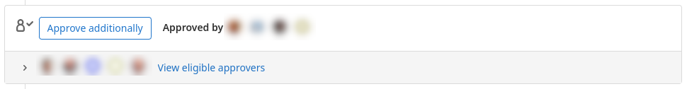
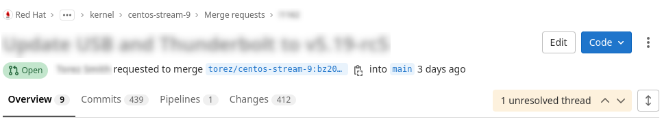

= Merge Request Approvals and Blocks
// Borrowed from https://github.com/asciidoctor/asciidoctor.org/issues/571
:caution-caption: pass:[☠]
:important-caption: pass:[❗]
:note-caption: pass:[🛈]
:tip-caption: pass:[💡]
:warning-caption: pass:[⚠]
:sectnums:

Users with sufficient permissions can Approve and Block Merge Requests.  Reviewers should use GitLab's Approve interface to link:merge_request_approvals_and_blocks.adoc#approving-a-merge-request[Approve Merge Requests].  Reviewers can also approve (aka ACK) or block (aka NACK) merge requests by adding a comment via the GitLab UI for the merge request using a `blocking thread` or using the `/block` and `/unblock` keywords.



== Approving a Merge Request via GitLab Web interface
:sectnums:

Reviewers can use GitLab's Approve interface to approve Merge Requests as this allows the maintainers, managers, and product owners to use the GitLab WebUI or tools to view the approvals for each merge request.

The WebUI has an “Approve” button that is available to users with sufficient permissions to review Merge Requests.

Here are some examples of what that "Approve" button might look like:

=== Example being the first to approve

In this above image, this is what to expect to see when there aren't any existing approvals on the MR.

=== Example approving in addiiton to others who have already approved

This image shows an MR that should already be satisfied enough to merge, but the option to approve additionally is also available.

=== Example being ineligible to provide an approval
image::images/approvals-webint-approve_ineligible.png[align="center"]

This image shows what the approval interface looks like when the necessary privilege is missing to provide an approval.

NOTE: There are various reasons for being ineligible to review a MR including (but not limited to) being the original author for this MR, and also not having developer permissions to the project.

== Approving a Merge Request using the 'lab' utilities
:sectnums:

This action can also be completed in lab by executing:

`lab mr approve <mr_id>`

== Blocking a Merge Request with a Blocking Thread (aka "soft block")
:sectnums:

There are currently two different ways to block an open MR.  The first is to open a GitLab blocking thread which needs to be resolved prior to the MR being able to get merged.

IMPORTANT: GitLab blocking threads can be resolved by any user.  GitLab blocking threads have no requirement that the thread be resolved by the thread author or the merge request author.  As such, GitLab blocking threads should be only be used when a response is not considered critical to the resolution of the merge request.

Here are a couple of examples to understand what a blocking thread involved MR looks like:

=== With unresolved blocking threads

In the above image, this MR will not be able to get merged until that 1 unresolved thread is marked as resolved.

=== With all blocking threads resolved

As displayed in this image, there were some blocking threads opened, but they have all been resolved.  Therefore, this MR will not be blocked from getting merged due to a blocking thread.

=== A freshly opened blocking thread

In the above image, this is what would be expected on a freshly created blocking thread from the comments portion of the MR.

=== Another freshly opened blocking thread (started from within code review)

This image shows that blocking threads can also be started from within the code while doing a review, which allows for providing some additional context.

=== A resolved blocking thread

The above image shows what a blocking thread looks like once it has been blocked.  Note that the list of comments has been collapsed and there is no "Resolve thread" button available.

== Blocking a Merge Request with the /block keyword (aka "hard block")
:sectnums:

The other way to block an open MR is to add a comment with `/block` in its contents (alone on the start of a line).  This is enforced by adding an approval rule (near the Approve button) that must be satisfied before the MR can be merged.

IMPORTANT: Comments created with '/block' can only be resolved by the comment author or a maintainer.  '/block' comments must be used when the commentor wants to prevent the merge request from being merged.  This 'hard block' is much stricter than the 'soft block' GitLab mechanism described above.  In the unusual case that a maintainer has to resolve a '/block' thread, management and senior engineering staff will be consulted on resolving the thread.

=== Example using /block keyword
image::images/approvals-blocked_keyword.png[caption=""]

The effect of this /block will have the `CKI KWF Bot` set the  label if there are still unresolved `/block` operations.  This is also reflected on the Ack/Nack summary comment.

=== Example of the Approval Rule showing up on a blocked MR

=== Example of the Approval Rule noted by the Ack/Nack Comment

== Unblocking a Merge Request with the /unblock keyword
:sectnums:

An important distinction to note between using `/block` and `blocking threads` is that only the originaly person who applied `/block` can apply the corresponding `/unblock`.

=== Example using /unblock keyword

Note that in this particular image, the Acks are not satisfied, but the  label has been removed by the `/unblock`.

== Unblocking a Merge Request with the Approve button
:sectnums:

An MR that has been blocked via the /block functionality can also be unblocked by using the Approve button as detailed in <<Approving a Merge Request via GitLab Web interface>>
