== Revumatic

== What is it?

revumatic is a tool that was developed by Red Hat to aid with the typical interactions needed on GitLab while working with kernel development.

== What is the scope of this document?

This document is intended to provide general guidance around what the revumatic tool is and what it can do.  It is expected that readers of this document have a basic understanding of Red Hat's kernel workflow and basic git functionality.

== What functionality does Revumatic offer?

The revumatic tool is intended to provide a central interface to GitLab, allowing the user to do things like interact with their TODO list or open merge requests as well as perform general review activities on related merge requests.

== Getting Started with Revumatic

In order to get started with revumatic, you will need to either install the packages via COPR or visit the gitlab page and then configure it to work with your gitlab account.

=== How to obtain/install Revumatic?

The revumatic tool can be found on https://gitlab.com/redhat/centos-stream/src/kernel/utils/revumatic[gitlab] with some instructions around building and installing the software.  The easiest way to obtain the software, though, is to install it via COPR, for example,  by running the following commands on a Fedora system:

```
dnf copr enable jbenc/review-tools
dnf install revumatic
```

(Other operating system instructions can be found on the https://copr.fedorainfracloud.org/coprs/jbenc/review-tools/[COPR page])

=== How to CONFIGURE Revumatic?

On the first start of revumatic after installation (assuming ~/.revumatic/config does NOT exist), the user will be prompted to paste an 'api'-enabled Personal Access Token (PAT).

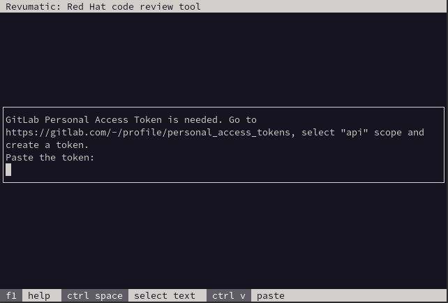

When the referenced URL is visited, a new token can be generated.  Make sure to check the box for `api` after providing a useful name to reference in the future.  Note that the expiration date is optional and can be cleared.

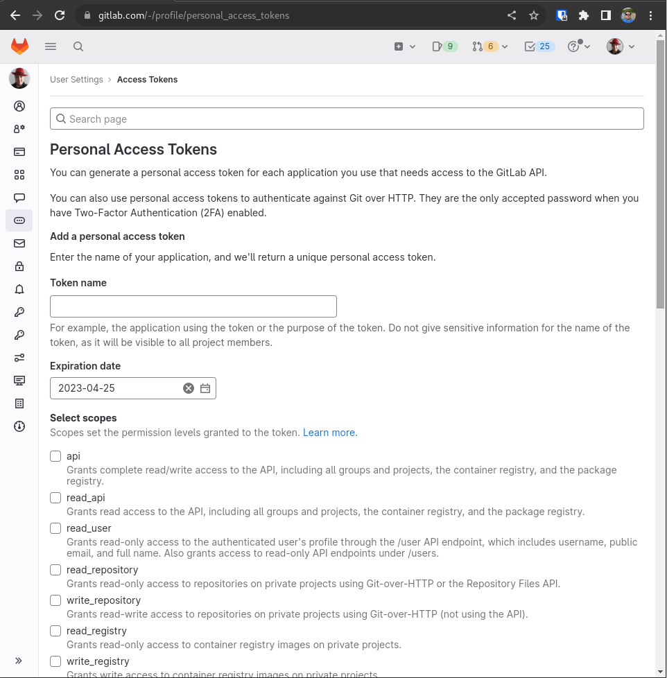

After hitting the `Create personal access token` button, a new field will show up with masked characters.  The content in this field will be neede to paste into the prompt in the `revumatic` utility.

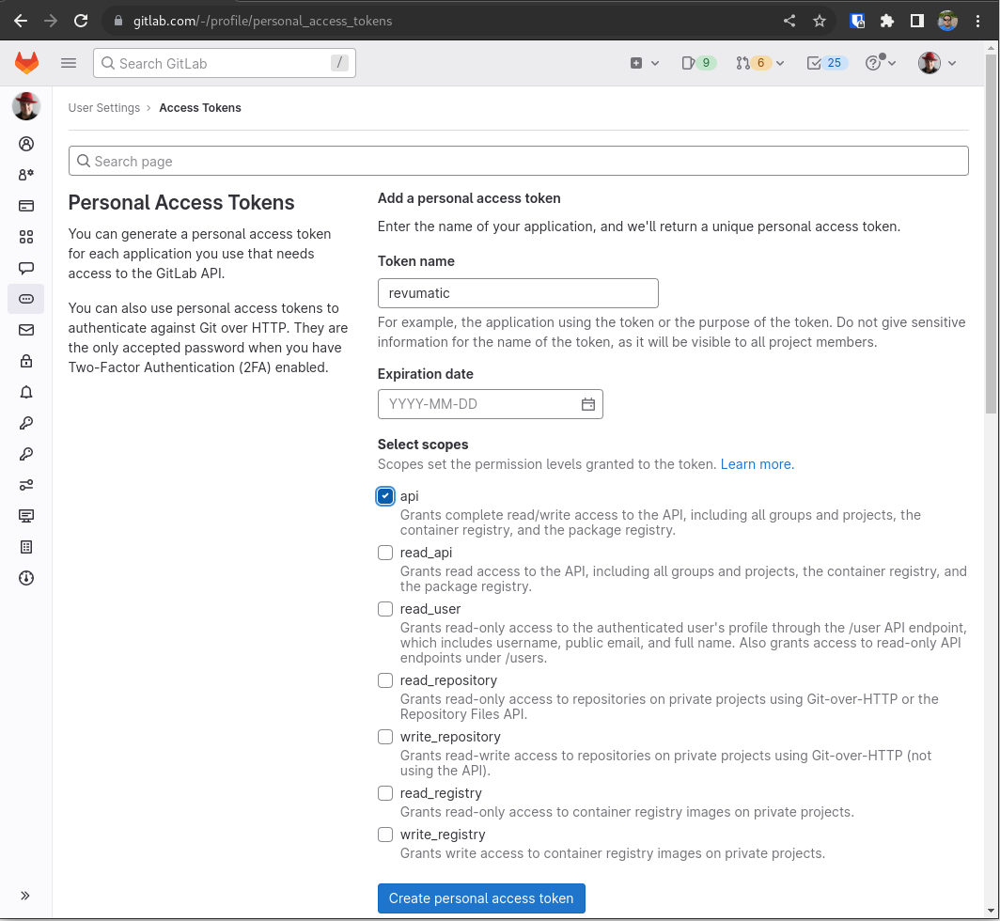

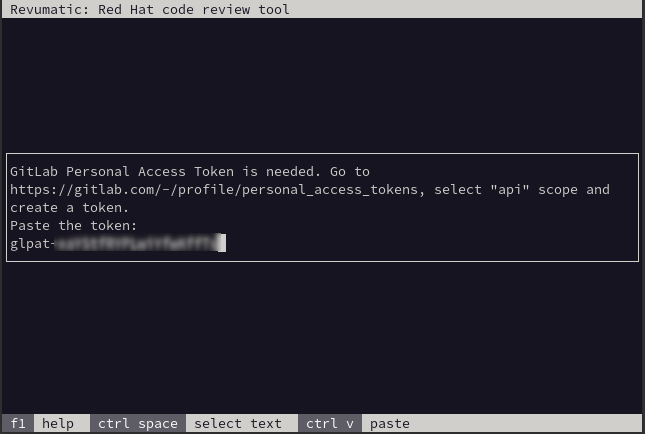

== How to USE Revumatic?

Each operation has a shortcut to access it directly from the command line, but if you simply enter `revumatic` with no arguments, it will launch with a menu of the various operations it provides.

=== Open a Merge Request

This functionality allows the user to fetch a specific MR that was opened using a local copy of the relevant repository to allow for review.  The MR in this scenario does not have to be something that is targeting the user directly, allowing them to perform a review for the sake of doing a review.

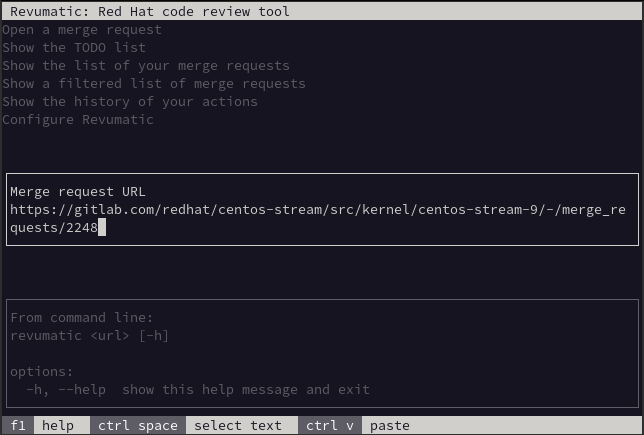

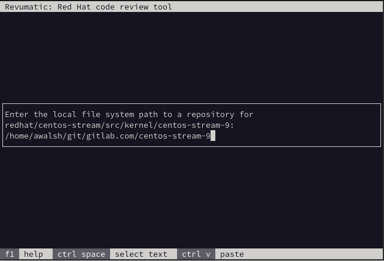

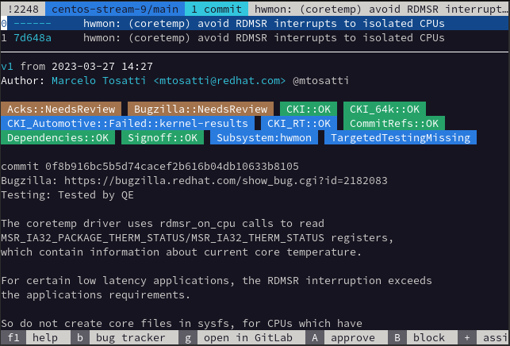

=== Show your TODO List

The various git services that are available have a notion of a TODO list.  This generally consists of things such as Merge Requests that are requiring some form of input from the user, such as tagging them as a reviewer or simply being mentioned in an existing Merge Request.  While in this interface, any of the listed Merge Requests can be selected and then interacted with such as performing a review.

_an image showing the TODO list_

=== Show the list of your current Merge Requests

This option allows the user to list the various Merge Requests that meet a certain criteria where they are listed such as being the approver, an assignee, the author, or an assigned reviewer.

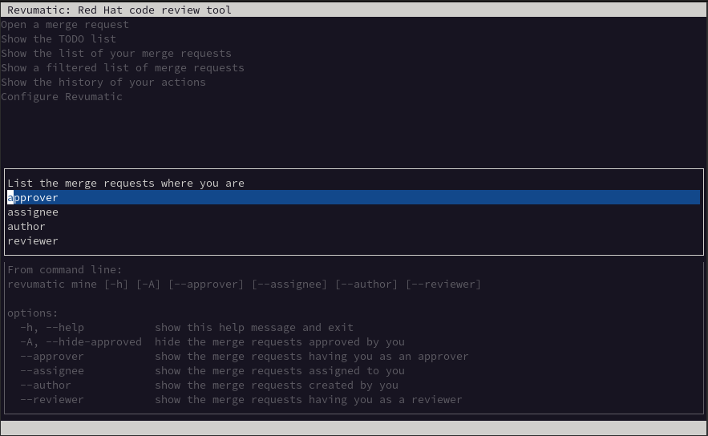

For example, here is a screen shot displaying the 'reviewer' option:

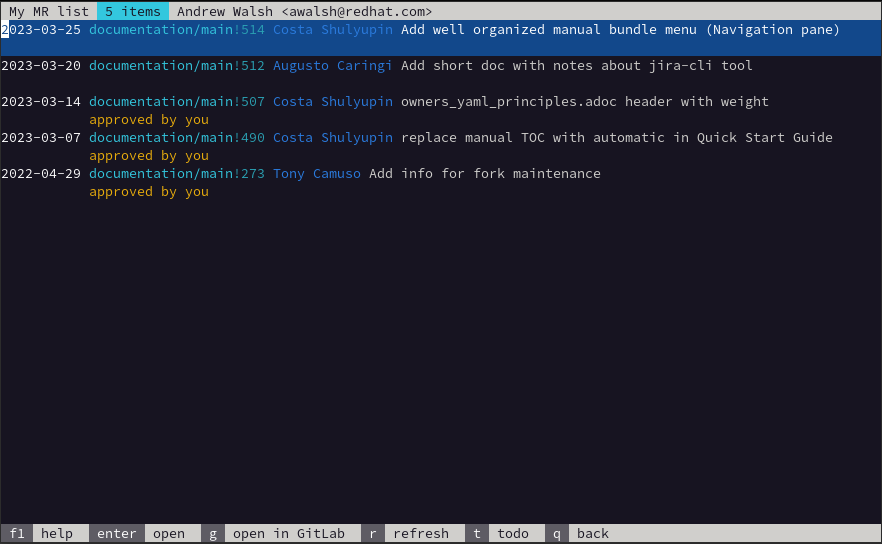

=== Show a filtered list of your Merge Requests

This functionality allows the user to search for specific terms just like they would on the Gitlab web interface.  Some examples are shown in the following screen shot.

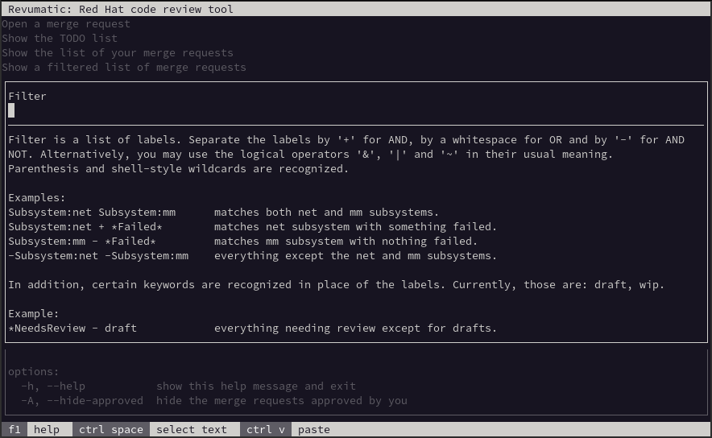

=== Show the history of your actions

The history functionality of this tool is localized to the interactions of the user on the machine in which the tool is installed.  The contents are populated via the configuration file stored at ~/.revumatic/history

=== Configuration

This option allows for the utility to be customized based on the user's preferences as well as allowing the GitLab Personal Access Token to be updated.

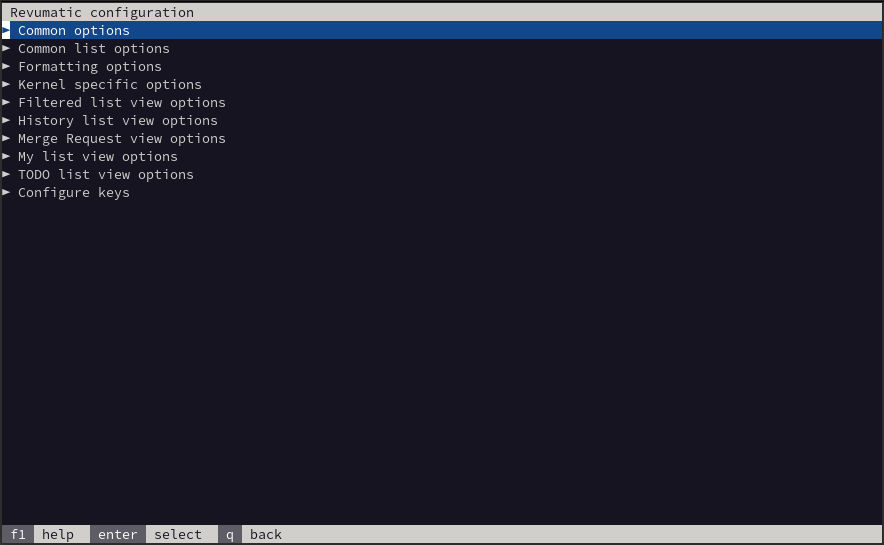

== Additional information

- Find the https://gitlab.com/redhat/centos-stream/src/kernel/utils/revumatic[upstream project] and file an issue!

