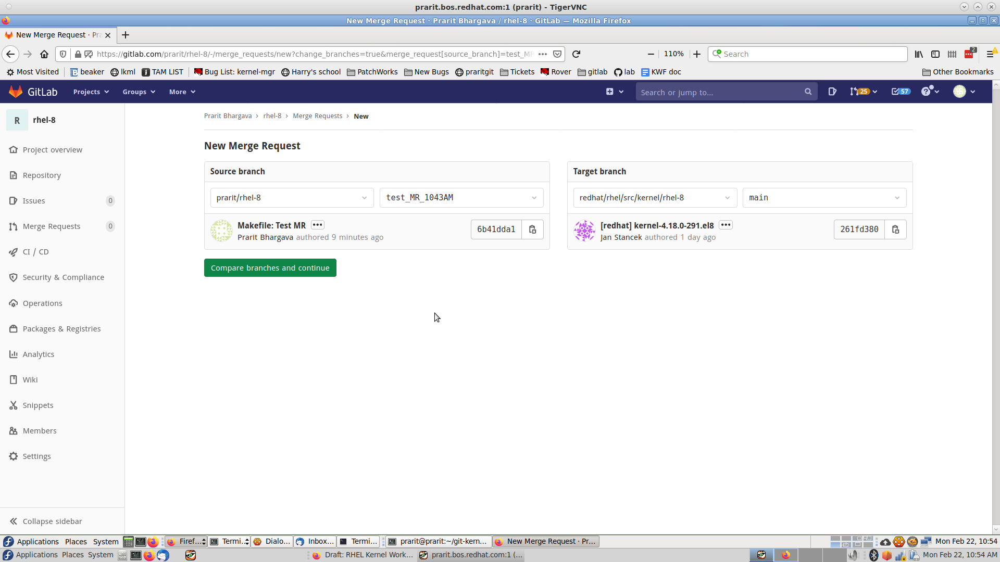
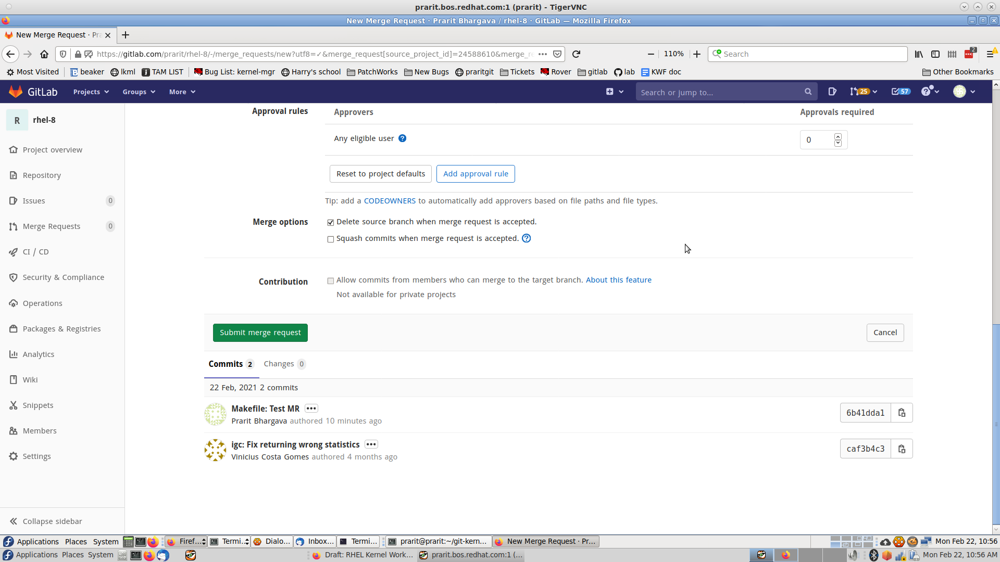
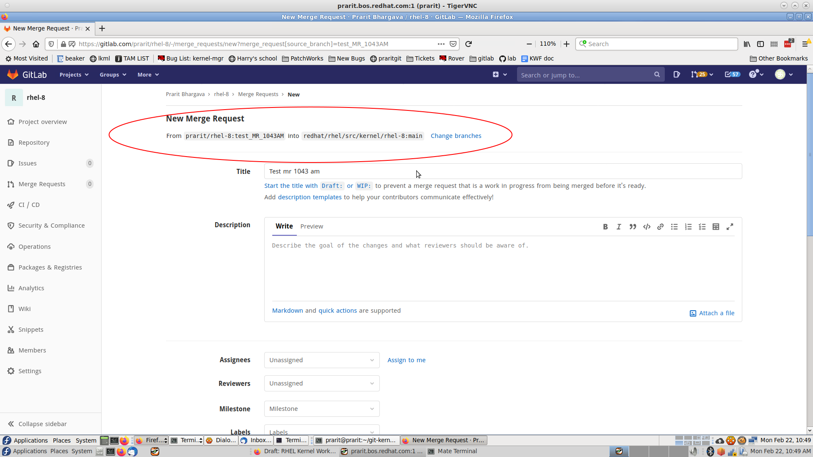

= Verifying a GitLab Merge Request

GitLab users often have issues which result in the incorrect number of commits being submitted for a Merge Request.  These issues include pushing to the wrong branch, merging against the wrong target branch, or merging from a local copy of a repository that has not been updated.  This section describes how to verify your merge request’s data before submitting the merge request.

The examples below were performed by creating a merge request with an out-of-date branch.  The result is that the number of commits in the merge request is two, when my branch only contained a single commit.

== Verifying with lab

The ‘lab mr create’ command will open a $GIT_EDITOR window.  The pre-populated contents will contain information about the submitted Merge Request.  For example,

	# Requesting a merge into origin:main from prarit:test_MR_1043AM (2 commits)

is included in the default Merge Request message.  This data shows that the target branch is “origin:main”, and the source branch is “prarit:test_MR_1043AM” with a total of 2 commits.  Comparing this to the GitLab WebUI example below, origin is redhat/rhel/src/kernel/rhel-8:main.

Using other ‘lab mr create’ options such as -F or -m will bypass the $GIT_EDITOR window.

== Verifying on the the GitLab WebUI

Instructions on creating a GitLab URL are provided when a user pushes to a GitLab fork.  For example, +
 https://gitlab.com/prarit/rhel-8/-/merge_requests/new?merge_request%5Bsource_branch%5D=test_MR_1043AM[https://gitlab.com/prarit/rhel-8/-/merge_requests/new?merge_request%5Bsource_branch%5D=test_MR_1043AM]

The first step in verification is to confirm that the source branch and target branch are correct.  These are highlighted in the image above.  To modify these targets click “Change branches” which provides options for changing the source and target branches.  Clicking “Compare branches and continue” will save your changes and take you back to the original URL.

The second step in verification is to confirm that the number of commits is correct.  This information can be viewed in the WebUI by scrolling down to the green “Submit Merge Request” button and viewing the information below that shows the number of commits, as well as each commit that will be in the submitted Merge Request.

This data shows that the target branch is “redhat/rhel/src/kernel/rhel-8:main”, and the source branch is “prarit:test_MR_1043AM” with a total of 2 commits.  Comparing this to the ‘lab’ example above, origin is redhat/rhel/src/kernel/rhel-8:main.

