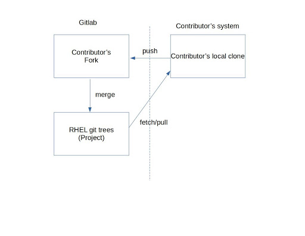



There are two similar definitions of a “GitLab Fork” in the GitLab documentation:

“A *fork* is a copy of an original repository that you put in another namespace where you can experiment and apply changes that you can later decide whether or not to share, without affecting the original project.”

and,

“A *fork* is a personal copy of the repository and all its branches, which you create in a namespace of your choice. This way you can make changes in your own fork and submit them through a merge request to the repository you don’t have access to.”

Both of these definitions define a fork as a personal copy of a repository where an engineer can provide changes for the public to review.

== Why do I need a fork?

The fork is the place where contributors will stage and provide code for review. In GitLab’s model of development, contributors have a local copy of the project where they develop code, a fork to publish code to, and the project to which they submit code for review.  In figure 1, the fork and project are hosted on GitLab, and the local clone of the repository is on the user’s private system.  Contributors push code to their GitLab fork, and from there request a merge into the project repository.  Once the code is approved and merged, contributors can pull directly from the repository into their local clone.

[#img-fork]
.Diagram of GitLab Model

== Should my fork be kept up-to-date?

Yes, in general you should keep your fork up-to-date.  As time goes on and your fork gets more out of date with the main project, actions like ‘git-push’ will take progressively longer as they’ll require more data to be sent to GitLab.

There are a few ways to keep your fork up-to-date.  This https://forum.gitlab.com/t/refreshing-a-fork/32469/2[GitLab forum entry] explains the options.  Users can also locally do, for example,

----
	git checkout main
	git fetch upstream
	git rebase upstream/main
	git push -f <fork_name> main
----

== Is it a requirement to keep my fork up-to-date?

No, there is no requirement for a fork to be kept up-to-date.  Git can compare the commits in a merge request branch against the project’s target branch (typically main or master), and determine the delta between the branches.  The delta will then be used as the commits that are included in a merge request.

== I’m confused.  How can an out-of-date fork have up-to-date changes in it?  That doesn’t make any sense.

This can be confusing because Red Hat Kernel development historically has used git in a very simple way: Developers clone the tree and update it (git pull or git fetch & git rebase) to get new changes.  git (not GitLab!) however, has more advanced features in which code between two branches can be compared and the net-result changes are identified for inclusion into a project.

These “advanced” features, and an explanation of why a user’s fork does not have to be kept up-to-date, are best explained with the example below in which a user’s code branch is updated on the fork even though the fork’s main branch is not current with respect to the project’s main branch.  The information in the tables below indicate the state of the trees, branches, and commits.

Suppose there is a project “SomeProject” with 5 commits, and they are numbered 1, 2, 3, 4, 5.  Also suppose userA wants to provide changes for the project.  SomeProject’s owner doesn’t want to give userA direct write access, as that could allow userA to contribute any code without review.

|===
|Tree|Branch|Commits

|SomeProject|main|1,2,3,4,5
|===

Since userA wants to make changes to SomeProject, they make a copy of SomeProject in a public location where it can be viewed on the internet.  This, in GitLab, is referred to as ‘forking’ a project, and userA’s copy of SomeProject is referred to as userA’s ‘fork’ of the project.  As a result of forking SomeProject, userA’s fork contains commits 1-5.

|===
|Tree|Branch|Commits

|SomeProject|main|1,2,3,4,5
|userA’s fork at GItLab|main|1,2,3,4,5
|===

userA needs to make a copy (git clone) of their fork on their local system where they can make and test changes.  This copy is not visible to others as it is *local* to userA’s system.  The local copy contains commits 1-5. userA can add SomeProject as a remote (git remote add upstream) to track new SomeProject changes.

|===
|Tree|Branch|Commits

|SomeProject|main|1,2,3,4,5
|userA’s fork at GitLab|main|1,2,3,4,5
|userA’s local copy|main|1,2,3,4,5
|===

While userA is doing this work, the upstream project is updated with commits 6 and 7 from another contributor.  SomeProject’s main branch is updated with these commits.

|===
|Tree|Branch|Commits

|SomeProject|main|1,2,3,4,5,6,7
|userA’s fork at GitLab|main|1,2,3,4,5
|userA’s local copy|main|1,2,3,4,5
|===

userA can get the two new commits into their local copy by fetching the changes from SomeProject (git fetch upstream, git-rebase upstream/main, or git-merge upstream).  userA’s local copy will now contain commits 6 and 7.  The fork, however, does not contain 6 or 7 as it has not been updated.

|===
|Tree|Branch|Commits

|SomeProject|main|1,2,3,4,5,6,7
|userA’s fork at GitLab|main|1,2,3,4,5
|userA’s local copy|main|1,2,3,4,5,6,7
|===

userA creates a branch in their local tree, userA_branch, makes some modifications, and commits the changes to the branch.  ie) userA adds userA_commit on the userA_branch.

|===
|Tree|Branch|Commits

|SomeProject|main|1,2,3,4,5,6,7
|userA’s fork at GitLab|main|1,2,3,4,5
|userA’s local copy|main|1,2,3,4,5,6,7
|userA’s local copy|userA_branch|1,2,3,4,5,6,7,userA_commit
|===

userA cannot directly commit their changes to SomeProject.  They must provide the code for review and do this by publishing their code.  In other words, userA wants to request that the changes in userA_branch be added to SomeProject.  This is done in two steps; first userA must make the code publicly available, and then request that the code be reviewed for inclusion into the main project.

In order to make the code publicly available, userA copies the userA_branch (git push fork userA_branch) that contains userA_commit to their public fork.  This creates a branch with the same name on the fork that includes commits 6, 7, and userA_commit.

|===
|Tree|Branch|Commits

|SomeProject|main|1,2,3,4,5,6,7
|userA’s fork at GitLab|main|1,2,3,4,5
|userA’s fork at GitLab|userA_branch|1,2,3,4,5,6,7,userA_commit
|userA’s local copy|main|1,2,3,4,5,6,7
|userA’s local copy|userA_branch|1,2,3,4,5,6,7,userA_commit
|===

userA then must request a review of the code in userA_branch in their fork.  They do this by opening a merge request with SomeProject (lab mr create) in GitLab.  GitLab, on the server side, executes ‘git-merge --no-commit’ to determine the commit delta between the fork’s userA_branch and SomeProject’s main branch.  As a result, a merge request containing the *net change *(ie, userA_commit) is generated.

In simpler terms, the branches SomeProject:main and userA’s fork:userA_branch are compared for merge and the result is a merge request containing userA_commit.   The two branches are highlighted in the table below, and the commit delta between the two branches is userA_commit.  As can be seen, the state of userA’s fork:main does not impact the merge request.

|===
|Tree|Branch|Commits

|SomeProject|main|1,2,3,4,5,6,7
|userA’s fork at GitLab|main|1,2,3,4,5
|userA’s fork at GitLab|userA_branch|1,2,3,4,5,6,7,userA_commit
|userA’s local copy|main|1,2,3,4,5,6,7
|userA’s local copy|userA_branch|1,2,3,4,5,6,7,userA_commit
|===

