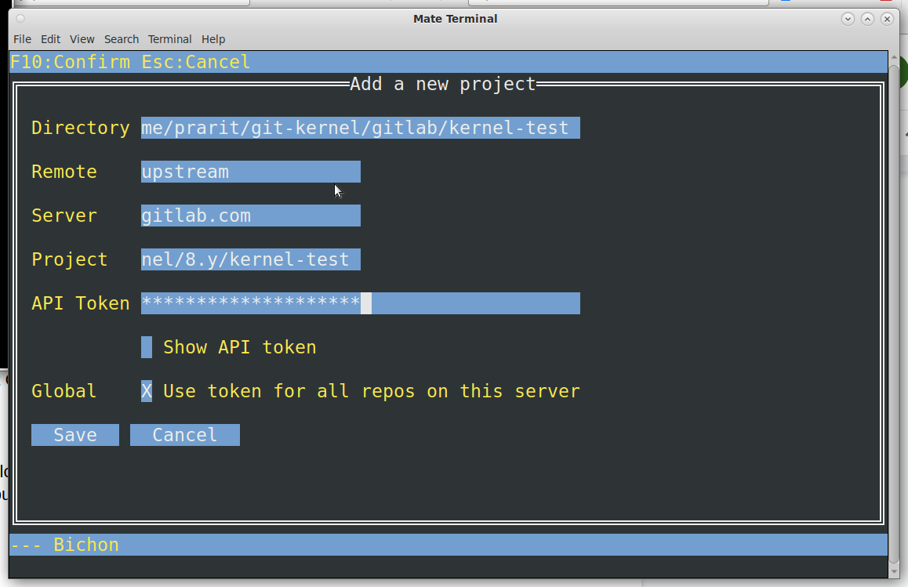
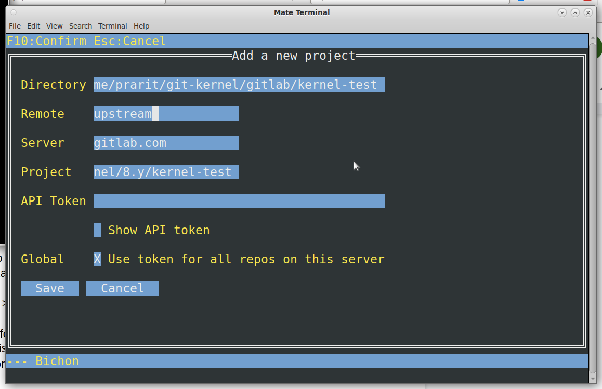
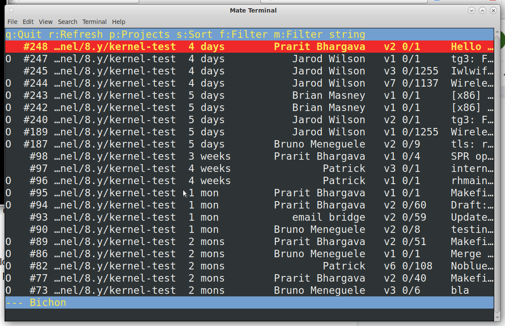
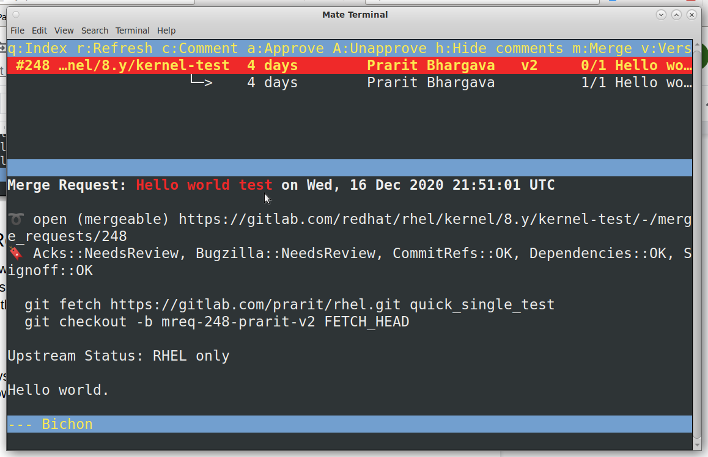
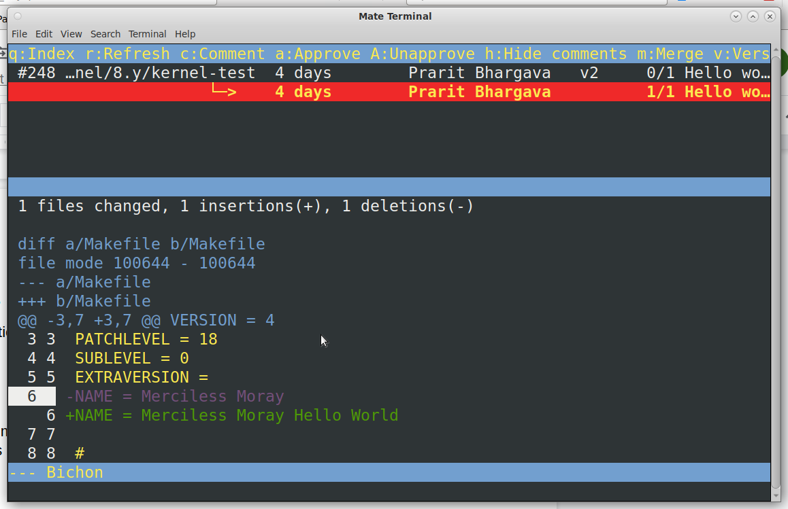
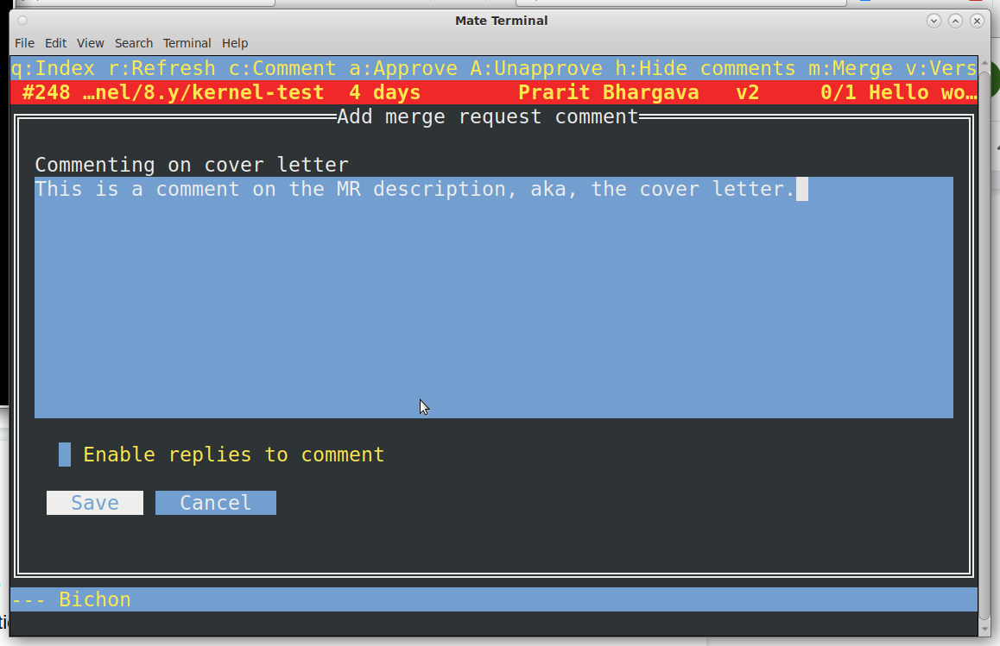
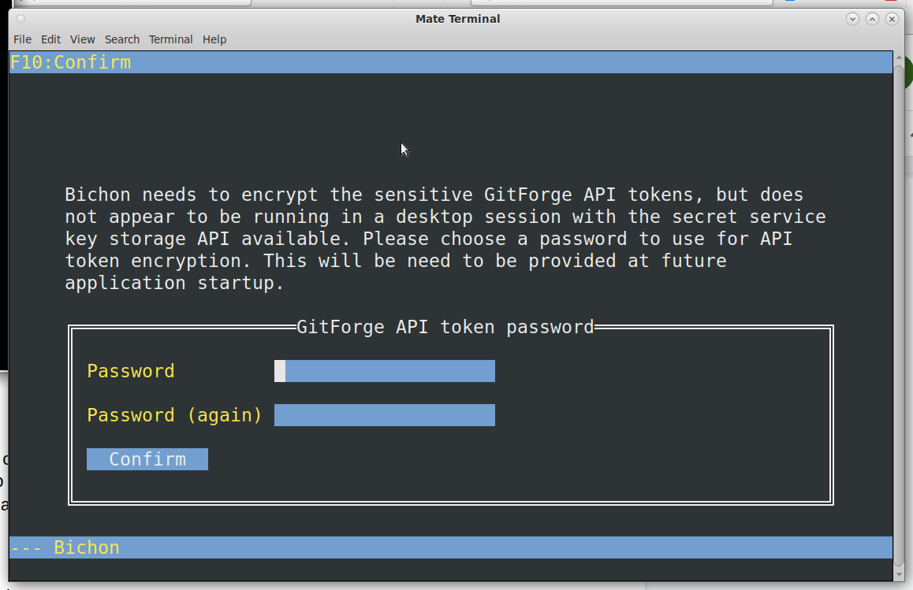
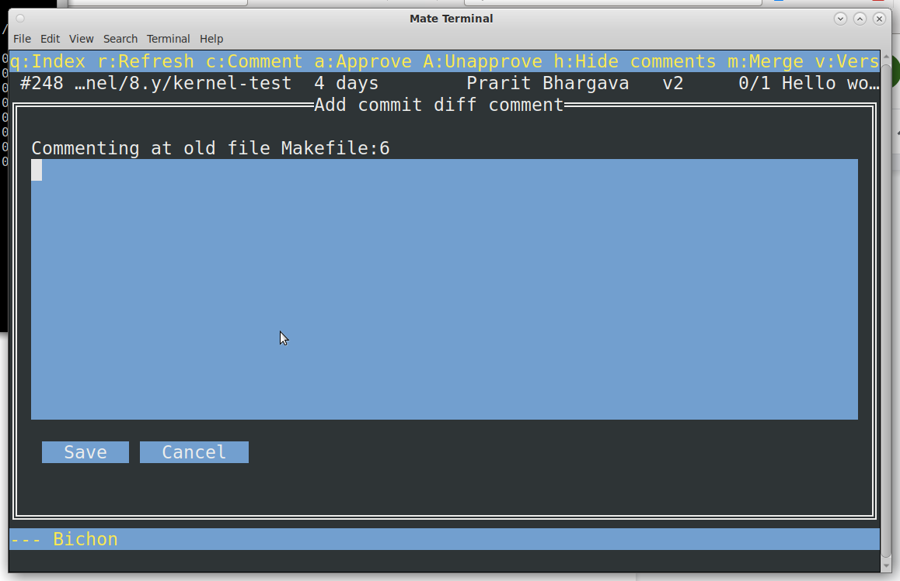

= GitLab ‘bichon’ utility and the Red Hat Kernel

An overview of the gitlab ‘bichon’ utility and how to use it to perform basic reviewer actions on the command line with Red Hat kernels hosted on GitLab.  Bugs for the bichon utility can be filed at https://gitlab.com/bichon-project/bichon/-/issues[https://gitlab.com/bichon-project/bichon/-/issues].

== Scope

Readers are assumed to have knowledge of git, the GitLab workflow, and the RHEL kernel development process. +++<u>+++** **+++</u>+++

+++<u>+++*The screen captures below are based on the author’s use of the bichon utility.  You must replace occurrences of ‘prarit’ with your own username in all highlighted *+++</u>++++++<u>+++*command*+++</u>++++++<u>+++* examples below.  *+++</u>+++The examples also assume that an ssh key has been configured for use with GitLab.

== Installing and configuring the ‘bichon’ Utility

The user may choose between installing a pre-built RPM package or by building it manually.

=== RPM installation

TBD (Bichon RPMs will not be available until mid-2021.  Please see the manual installation instructions below)

The RPM package is available in a https://copr.fedorainfracloud.org/[COPR] repo.  Users must enable the rhkernel-devtools repository to use it through _dnf_:

	dnf copr enable -y bmeneguele/rhkernel-devtools

Users can now install the bichon tool using the default package by executing:

	dnf install -y bichon

_Note: __RHEL and Fedora users may have different versions of bichon.  Fedora packages may get upgraded to pre-release versions, while RHEL packages will always point to the latest stable version._

Packaging bugs can be reported by opening up issues at https://gitlab.com/ptalbert/rhkernel-devtools[https://gitlab.com/ptalbert/rhkernel-devtools].

=== Manual build

Users must link:go_tools_compile.adoc[install /usr/bin/go] on their systems before building ‘bichon’ (follow the link for instructions).   Users can build ‘bichon’ by executing,

	git clone https://gitlab.com/bichon-project/bichon.git
	cd bichon
	go build

+++<u>+++The ‘go build’ command will take some time as go package dependencies are resolved+++</u>+++.  After completion, move the bichon command to somewhere in your $PATH.

=== Configuration

To configure bichon, execute

	cd <some_GitLab_fork>
	bichon

and the utility will query for configuration information.  First, encryption needs to be set up in order to securely store GitLab Tokens. bichon will attempt to use the system key storage for this purpose (in which case you will not see the next screen). If key storage is not available, bichon will query for a new password.  Note that it is this password, and not the GitLab Token, that will be entered every time bichon is started.

The next screen will query for configuration details of this project.  By default, bichon assumes the project’s remote name is ‘origin’.  If the project has a different remote name (eg. ‘upstream’) use that name in place of origin.

bichon requires a link:RH_and_GitLab_Configuration.adoc#user-content-gitlab-personal-access-tokens[GitLab Personal Access Token (PAT)].  The PAT must be entered on this screen.

Next screen will auto download a list of all open MRs.  Depending on the number of open MRs, this may take some time to populate the list.

== Troubleshooting bichon

* Was bichon installed from COPR?
* Are you sure your PAT is for scope “API”?

See IRC channel #patch-tools for live help with ‘bichon’.

Bichon bugs can be reported by opening up issues at https://gitlab.com/bichon-project/bichon/-/issues[https://gitlab.com/bichon-project/bichon/-/issues].

== Developer Actions

bichon is a reviewer tool, and as such is not useful for developers. Please use the link:lab.adoc[lab] tool for developer actions.

== Reviewer Actions

=== Checking out a Merge Request

On start, bichon will query the project and checkout new merge requests.  The main bichon screen will populate with open merge requests which may take some time depending on the number of new merge requests.  Users can also press ‘r’ to refresh the Merge Request list.

=== Viewing a Merge Request (and comments)

Merge requests can be viewed in bichon by using the up and down arrow keys to highlight a specific MR, and then pressing ENTER to select the MR to view.  This will open a split screen with the tree of commits at the top, and the MR description at the bottom.

The left and right arrow keys can be used to select between the MR description and commits, while the up and down arrow keys can be used to view the description or commit code.

=== Adding Comments to a Merge Request

Comments to MRs descriptions are made by selecting the MR description, selecting ‘c’ and entering in a comment.

Comments to commits are made directly in the code and then selecting a specific line of code, and then selecting ‘c’.  This is shown in the two images below.

And then selecting ‘c’ to comment on the line,

=== Need help?

Feel free to contact Jiri Benc <mailto:jbenc@redhat.com[jbenc@redhat.com]>, IRC nick jbenc.

