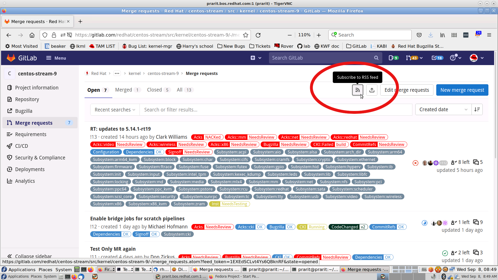



GitLab-based workflows provide several notification options to code maintainers and interested parties to be notified of merge requests.  These options include GitLab Email and ‘@’ notifications, GitLab RSS, GitLab CODEOWNERS, CKI, and Red Hat kernel-watch project.

By default users will receive notifications for GitLab ‘@’ mentions and notifications for any Merge Request or Issue they open.  Code Maintainers should review the link:kernel_changeset_notifications.adoc#code-owners[Code Owners] section below, and contributors interested in specific files or directories should look at the link:kernel_changeset_notifications.adoc#kernel-watch[kernel-watch] section.

== GitLab Email and ‘@’ mentions

GitLab has a highly-tunable https://docs.gitlab.com/ee/user/profile/notifications.html[email notification system].  Emails are sent to participants (contributors, reviewers, and commenters) of merge requests.   Similar to Twitter and other messaging platforms, additional participants can be notified via ‘@’ mentions.  For example, to notify username rhuser a comment could be added to the merge request with ‘@rhuser’.  This action would result in an email being sent to rhuser with the comment and a link to the merge request.

== kernel-watch

Kernel-watch is a project that along with a kernel webhook allows individual contributors who are not link:kernel_changeset_notifications.adoc#codeowners[CODEOWNERS] to be notified of changes.  The kernel-watch git tree contains one file for each contributor that can only be modified by the contributor.  The contributor’s file contains the names of projects and files or directories that the contributor is interested in watching.

A link:rhel_kernel_workflow.adoc#Kernel-webhooks[Red Hat kernel webhook] has been written that will execute every time that a merge request is submitted to a Red Hat kernel project.  If the merge request’s modified files or directories are listed in a contributor’s file, an ‘@’ mention for the contributor will be added to the merge request.  As a result, the contributor will be notified via email of the merge request.

== Webhooks

The https://gitlab.com/cki-project/kernel-webhooks/[kernel-webhooks] project adds GitLab Reviewers and labels to Merge Requests through several methods.

=== Subsystem Labels

The https://gitlab.com/redhat/centos-stream/src/kernel/documentation/-/blob/main/info/owners.yaml[documentation project’s owners.yaml file] contains information about each kernel subsystem, including a label for each subsystem, and the files that belong to each subsystem.  When a contributor submits a merge request, the webhooks interpret the information from owners.yaml to apply Subsystem Labels to the merge request.  A list of all available labels for a project can be found in the project’s issues settings (for example, the list of the Red Hat kernel’s rhel-8 project labels can be found https://gitlab.com/redhat/rhel/src/kernel/rhel-8/-/labels[here]).  Users can subscribe to labels and will receive an email notification when a merge request is tagged with the subscribed label.

=== Ack/Nack

The Ack/Nack webhook (commonly referred to as the Ack/Nack bot) uses maintainer and reviewer information from the https://gitlab.com/redhat/rhel/src/kernel/documentation/-/blob/main/info/owners.yaml[documentation project’s owners.yaml file].  The Ack/Nack webhook adds *all listed maintainers and reviewers* as GitLab Reviewers to matching Merge Requests.

== GitLab RSS

Each GitLab project provides a variety of RSS feeds that users can subscribe to, and RSS link buttons can be found on the main panel.  For example, the RSS feed button to subscribe to merge request notifications is highlighted in a red circle on this screenshot https://gitlab.com/redhat/centos-stream/src/kernel/centos-stream-9/-/merge_requests[of the centos-stream-9 merge request page],

_Configuration of RSS feeds is dependent on your choice of browser and choice of RSS feed reader_.  Firefox users have also reported requiring having to copy-and-paste GitLab RSS links into many popular RSS readers.

GitLab provides RSS feeds and cannot be modified by Red Hat.

== Code Owners

TBD - have to implement this. +
GitLab has a review mechanism that will automatically assign required reviewers for code changes called https://docs.gitlab.com/ee/user/project/code_owners.html[Code Owners] that is similar in functionality to the kernel’s MAINTAINERS file & scrits/get_maintainers.pl.  Code Owners allows project maintainers to assign ownership of files or directories to specific contributors or groups of contributors.  Emails notifications are sent to these contributors alerting them to MRs that modify their areas of responsibility within the kernel.

Code Owners are listed in the project’s .gitlab/CODEOWNERS file, and is typically referred to as simply CODEOWNERS.  Like any other changes made to the kernel, modifications to CODEOWNERS must be made through a merge request to the kernel project.

== Self Scripted Solutions

Contributors are encouraged to write and submit their own scripts to the https://gitlab.com/redhat/centos-stream/src/kernel/utils/tools[kernel-tools] project.

== GitLab Email Bridge

The https://gitlab.com/cki-project/patchlab[GitLab Email Bridge] mimics the traditional email-based review process by converting GitLab merge request changesets and comments into email.  The Email Bridge is only temporary to assist during the transition between the email-review process and the GitLab review process.* Users of the Email Bridge should not depend it’s output in the long-term. *

*The Email Bridge for RHEL kernels will be taken out of service on +++<u>+++February 22, 2022*+++</u>+++**.**

The table below contains configured Email Bridge projects and the mailing list where the Email Bridge sends notifications.

|===
|Project|Email list

|https://gitlab.com/redhat/rhel/kernel/8.y/kernel-test/[kernel-test]|http://post-office.corp.redhat.com/mailman/listinfo/kwf-test[kwf-test@redhat.com]
|https://gitlab.com/cki-project/kernel-ark[kernel-ark]|https://lists.fedoraproject.org/admin/lists/kernel.lists.fedoraproject.org/[kernel@lists.fedoraproject.org]
|===
=== Adding additional metadata to Email Bridge email

Users can add metadata to the “cover-letter” email sent by the Email Bridge by adding additional metadata in brackets to the merge request title.

For example, creating a merge request with title “[BZ123456] This interesting patch” will result in an Email Bridge cover letter of “[RHELX.Y][BZ 123456] This interesting patch”.

