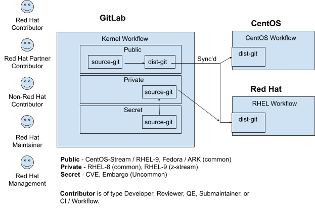
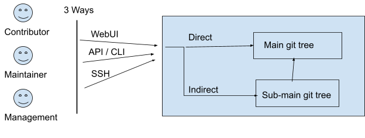

= RHEL Kernel Workflow

https://red.ht/kernel_workflow_doc[https://red.ht/kernel_workflow_doc]

The RHEL Kernel Workflow is used by Red Hat-based kernel projects including RHEL Kernels, CentOS Stream kernels, the Fedora kernel, and the Always Ready Kernel (ARK).  The RHEL Kernel Workflow is built upon the standard https://docs.gitlab.com/ee/topics/gitlab_flow.html[GitLab workflow] and uses GitLab Merge Requests as the only way to make changes to the Red Hat kernel.

At Red Hat, all work is directed through the analysis of user bug reports.  Contributors (ie, engineers) review bugs and identify work to be completed for each bug.  For each bug, a contributor codes a fix and submits the code for review.  Reviewers analyze the fix, and when they are satisfied with the fix, the maintainers accept the fix into the codebase.  The modified codebase is tested by Quality Engineering, and when they are satisfied with the results of testing, the Documentation team will document the changes for our customers.

This process requires coordination between multiple Engineering groups at Red Hat, using multiple tools and internal processes.  The sections in this document provide details on the roles of the mentioned groups, the tools used by each group, and both inter-group and intra-group processes.

== How to use this guide

This guide is written to provide contributors, maintainers, and management with an overview of their processes in the construction of a Red Hat Kernel, and also provides account setup and configuration information that is useful for all kernel development roles. This guide uses two main diagrams in the <<Roles>> section as a base to provide readers with instructions on how to contribute to Red Hat kernels.

*Advanced** users that have experience with this workflow can use the <<Processes>> section **for information on workflow updates.*

=== Documentation Contributor Instructions

Constructive updates and contributions are welcomed and are greatly appreciated.  Contributors should understand this document focuses on the experience of engineers in different roles (maintainers, developers, reviewers, etc).  Small and medium process changes should not result in changes to this top-level document. Implementation details should be kept to a minimum; please reference projects’ URLs or projects’ documentation instead of providing advanced details.  Where possible, please reference other documents through hyperlinks in this document.

Problems or concerns with the workflow can be addressed on mailto:kernel-info@redhat.com[kernel-info@redhat.com] or by filing a GitLab issue at https://gitlab.com/redhat/rhel/src/kernel/bugreports[Red Hat Kernel bug reports].

== Scope

It is expected that readers are familiar with the concepts of git, kernel code hacking, and backporting code changes from upstream trees.  *The explanation of these concepts are not found within this guide*.

== Definitions

Email Bridge - An https://gitlab.com/cki-project/patchlab[application] that converts the commits associated with a GitLab Merge Request to individual emails that are currently used for review. The Email Bridge is deprecated, and only used as a bridge between the old internal email-based workflow and the GitLab-based workflow. It is scheduled to be shut down on Feb 22 2022.

Fork - see link:what_is_a_GitLab_fork.adoc[What is a GitLab Fork?]

Kernel Workflow (RHEL Kernel Workflow, KWF) - The process by which changes are implemented in the Red Hat Kernel.

Merge Request (MR) - As defined by GitLab, a Merge Request (MR) is a _request_ to _merge_ one branch into another. It is the basic block used for information transfer between branches.

source-git: A traditional git tree used by developers everywhere for hacking on source code..

dist-git: A packaging git tree used by distro package maintainers.  A git repository that contains a tarball, RPM spec file and patches.  These repositories may or may not contain uncompressed source code, and are typically used by maintainers that need to construct RPMs.

== Roles

There are five roles (Red Hat Contributor, Red Hat Partner Contributor, Non-Red Hat Contributor, Red Hat Maintainer, and Red Hat Management) in the Kernel Workflow.  The Kernel Workflow has three levels of public exposure for projects (Public, _Private_, and Secret).  These projects all have source-git repositories, but only Public projects also have a dist-git repository.  Two of these Public projects are the CentOS Stream and RHEL Kernels.

Each role will require a different level of code access.  For example, Maintainers will require access to both source-git and dist-git repositories, while Management may only require access to statistical information from the source-git repositories.

=== What is my role?

Determine which role you are interested in using the diagram above.  Most readers of this document are a contributor or maintainer.

==== Red Hat Contributor

Red Hat employees can contribute to the Red Hat kernel GitLab projects as Developers or Reviewers.  See the <<Contributor>> section for more details.

==== Red Hat Partner Contributor

Red Hat Partners can contribute to Red Hat kernel GitLab projects as Developers, and in some cases, as Reviewers.  See the <<Contributor>> section for more details.

==== Non-Red Hat Contributor

Non-Red Hat Contributors can contribute to the Red Hat kernel GitLab projects as Guests. They have restricted CI and review capabilities.  See the <<Contributor>> section for more details.

==== Red Hat Maintainer

Red Hat employees can process and commit contributions to the Red Hat kernel Gitlab projects as Maintainers for their project.  See the <<Maintainer>> section for more details.

==== Red Hat Management

Red Hat managers track changes made to the Red Hat kernels.  Managers that require access to the Red Hat kernel GitLab projects should review the <<Management>> section for more details.

=== How do I contribute?

Contributors, maintainers, and management can interact with projects through the WebUI, through API/CLI tools, or via SSH.  Contributors can make direct contributions by submitting MRs to the main git tree, or make indirect contributions via submaintainers.

Determine which role you are interested in from the diagram above, and read the section on that role below.

=== Contributor

Contributors may both provide and review code to Red Hat kernel projects via GitLab Merge Requests.  The contributions can occur via the GitLab WebUI, through API/CLI tools, or via SSH.  Contributions can occur directly to the project or via a submaintainer.

==== Setup

New users should follow the <<Account Setup & Configuration>> and configure link:rhel_kernel_workflow.adoc#Tools[tooling for working with the Red Hat kernel trees] sections below.  Advanced users may optionally reference the link:README.adoc[Developer Quick Start Guide].

==== Developers for RHEL

Red Hat uses its own Bugzilla instance, https://bugzilla.redhat.com[https://bugzilla.redhat.com], to track feature requests and bug reports.  *All contributions must be associated with a bugzilla, so all contributors are required to have a* link:rhel_kernel_workflow.adoc#bugzilla-configuration[*bugzilla account*].

Contributions to Red Hat kernel projects can be rejected for both formatting, procedural, and technical concerns. Contributions must strictly adhere to the link:CommitRules.adoc[Red Hat Kernel Guidelines for Commits and Merge Requests] (a.k.a CommitRules) to avoid rejections for trivial issues.

RHEL Developers can find additional information on the contribution process in the <<Contributor Developer Processes>> section.  Long time developers of the RHEL kernel may find it useful to link:email_vs_GitLabMR.adoc[review the differences between an email-based workflow and the GitLab model].

==== Reviewers for RHEL

All contributions to the Red Hat Kernels must be reviewed by Red Hat engineers, however, at management discretion Red Hat Partner Engineers may be asked to review contributions.

Reviewers must examine changesets for stability, security, and other technical issues.  If the changes are acceptable reviewers can respond with a positive acknowledgement (ACK), or if the changes   additional refinement reviewers can respond with a rejection (NACK).

Reviewers can find instructions on providing ACKs and NACKs, and other information on the review process in the <<Contributor Reviewer Processes>> section.

==== Developers for kernel-ark (ARK) or Fedora

Contributors for the upstream kernel-ark tree can find details on how to contribute to the kernel-ark project in the https://cki-project.gitlab.io/kernel-ark/[kernel-ark WIKI].

==== Quality Engineering for RHEL

Quality Engineering (QE) contributors are responsible for verifying the stability and functionality of changes proposed in MRs.  The QE verification process may include checking that the correct automated tests are run, manually testing the changes themselves, and/or working with non-Red Hat QE to run tests.

Most MRs are blocked until an assigned QE person verifies the stability and functionality of the changes.  <TBD: Process for QE verification>.

All Red Hat QE Engineers must have a link:rhel_kernel_workflow.adoc#bugzilla-configuration[bugzilla account].  Red Hat uses its own Bugzilla instance, https://bugzilla.redhat.com[https://bugzilla.redhat.com], to track feature requests and bug reports.  All contributions must be associated with a bugzilla so *all contributors must have a Red Hat bugzilla account*.

==== CI / Workflow Contributor

CI / Workflow contributors are responsible for the backend automation that implements https://gitlab.com/cki-project/kernel-webhooks[https://gitlab.com/cki-project/kernel-webhooks] project.

=== Maintainer

Maintainers are responsible for integrating GitLab MRs to the Red Hat kernel into a branch and ensuring the link:CommitRules.adoc[Red Hat Kernel Guidelines for Commits and Merge Requests] are followed.  Maintainers are  responsible for pushing branches to the next stage of development.

The commit rules are enforced by <<Kernel-webhooks>> and GitLab.

==== Setup

New users should follow the <<Account Setup & Configuration>>.

All Red Hat maintainers must have a link:rhel_kernel_workflow.adoc#bugzilla-configuration[bugzilla account].  Red Hat uses its own Bugzilla instance, https://bugzilla.redhat.com[https://bugzilla.redhat.com], to track feature requests and bug reports.  All contributions must be associated with a bugzilla so *all maintainers must have a Red Hat bugzilla account*.

==== Kernel Maintainer

The kernel maintainer is a maintainer that commits and pushes changes from the source git tree to the dist-git tree. They are responsible for following the TBD:<dist-git process>.

Kernel maintainers can use the TBD:<Patch Ready Process> to determine which MRs can be committed to the git tree.

==== Kernel Submaintainer

TBD.

The kernel submaintainer is a maintainer that commits and pushes changes from a forked source git tree to another source git tree (generally the main tree maintained by the kernel maintainer).  Their forked source git tree should be correctly TBD:<configured link> to utilize <<Kernel-webhooks>>.

Kernel Submaintainers can use the TBD:<Patch Ready Process> to determine which MRs can be committed to the git tree.

When the submaintainer determines their tree is ready for inclusion into the main git tree, they follow the <<Contributor Developer Processes>> to submit a merge request.

==== Kernel Embargo Coordinator

TBD.

The kernel embargo coordinator is a maintainer that handles secret commits that are not consumable for public consumption for a given amount of time.  They commit and push changes from a restricted forked source git tree to another source git tree (generally the main tree maintained by the kernel maintainer).

Follow the <<Kernel Submaintainer>> section using the Embargo rules when possible.

=== Management

Management is responsible for ensuring Red Hat Kernel changes are delivered according to their predetermined deadlines.  Managers typically do not directly contribute to the Red Hat kernel and need to access GitLab for status and changeset information.  Managers should review the <<Account Setup & Configuration>> section.

==== Setup

New users should follow the <<Account Setup & Configuration>>

==== Subsystem Team Leads

TBD.

==== Red Hat Managers

TBD.

== Kernel Git Repository Information

There are many public and private link:kernel_git_repo_info.adoc[source-git and dist-git repositories] that are used in the construction of the Red Hat and CentOS Stream kernels.  The repositories include both kernel source code control and testing (CKI) repositories.

== Notifications

The Red Hat Kernel Workflow uses email to inform developers about changesets they may be interested in or are responsible for reviewing.  Information on the different types of notifications, including GitLab Email, CODEOWNERS, and kernel-watch can be found link:kernel_changeset_notifications.adoc[here].

== Processes

The Red Hat Kernel Workflow uses link:https://gitlab.com[GitLab] and link:https://bugzilla.redhat.com[Red Hat's Bugzilla instance] as the engines of change for the RHEL kernel.  Contributors, Reviewers, Maintainers, and Managers have processes that interact with these two tools.  Information and instructions for many of these processes are detailed in the subsections below.

=== Contributor Developer Processes

Contributors can follow link:general_build_instructions.adoc[these instructions] to locally compile the kernel.  Contributors can use the GitLab WebUI to contribute code through Merge Requests.  Red Hat recommends the GitLab command line interface tool, link:lab.adoc[lab], for submitting Merge Requests.

==== Submitting a Merge Request

Contributors can follow these general https://docs.gitlab.com/ee/user/project/merge_requests/creating_merge_requests.html[instructions on submitting an MR] using the GitLab UI.  Contributors to RHEL kernel projects should also follow these Red Hat specific instructions on link:lab.adoc[lab] GitLab command line tool can also be used to submit Merge Requests.

The <<Kernel-webhooks>> will automatically assign reviewers based on the changeset's code content.  Changesets that modify many subsystems or drivers will result in a large number of reviewers assigned to the merge request.  To avoid this problem it is strongly encouraged that Merge Request Authors follow upstream's guidance on separating code changes: "https://www.kernel.org/doc/html/latest/process/submitting-patches.html#separate-your-changes[If you cannot condense your patch set into a smaller set of patches, then only post say 15 or so at a time and wait for review and integration]".

==== Bot Tasks and Commands

After the merge request has been created, the developer can follow the status of the automated checks and the review process using scoped labels created by the <<Kernel-webhooks>>. The checks can also be triggered again by putting webhook commands in the MR comments.

=== Contributor Reviewer Processes

All reviews can be completed through the GitLab WebUI.  Red Hat recommends the GitLab command line interface tool, link:bichon.adoc[bichon], for reviews.  Reviews for the can also be completed by replying to email from the Email Bridge.

==== Approving and Blocking Merge Requests

Red Hat Employee Contributors can follow the link:merge_request_approvals_and_blocks.adoc[Merge Request Approval Procedure].  In some cases, Red Hat Partner Contributors may be asked by their manager to also review Merge Requests.

Non-Red Hat Contributors are able to participate in discussions but do not have the ability to approve or block merge requests.

==== Finding Merge Requests to review

Reviewers can find MRs to review by using the ‘Merge Requests’ tab on the GitLab UI for the Project, or use the https://gitlab.com/prarit/rhstatus[rhstatus] tool.  Additionally both the link:https://gitlab.com/zaquestion/lab[lab] and https://gitlab.com/bichon-project/bichon/[bichon] tools provide functionality to import and display MRs.

Reviewers that are interested in watching change in specific areas of the kernel should review the <<Notifications>> section.

=== Maintainer Patch Ready Process

TBD.

Maintainers rely on <<Kernel-webhooks>> to determine if a merge request is safe to commit. Every merge request must pass a technical review, business review and testing before being approved.

To determine which patches are ready for inclusion, the maintainer can use the WebUI or the link:lab.adoc[lab].

=== Management Process

TBD.

== Account Setup & Configuration

=== Bugzilla Configuration

Red Hat uses its own Bugzilla instance, https://bugzilla.redhat.com[https://bugzilla.redhat.com], to track feature requests and bug reports.  Red Hat requires that all contributions must be associated with a bugzilla so *all contributors must have a Red Hat bugzilla account*.  To open a new bugzilla account see https://bugzilla.redhat.com/createaccount.cgi[https://bugzilla.redhat.com/createaccount.cgi].  For additional reference or questions read https://bugzilla.redhat.com/docs/en/html/using/index.html[Red Hat’s Bugzilla User Guide].

Red Hat employees must associate their redhat.com email address with their bugzilla account, and must be part of the "Redhat: Red Hat Employee (internal)" group.  Red Hat employees can request access to the group https://bugzilla.redhat.com/page.cgi?id=workflows/group_request.html[here].

Instructions for https://bugzilla.redhat.com/docs/en/html/using/filing.html#reporting-a-new-bug[creating bugzillas] can also be found in Red Hat’s Bugzilla User Guide.  When creating a bugzilla for the kernel, reporters should be sure to clearly explain what the problem they encountered was, how it occurred, and if necessary, what platform (vendor and model) it was seen on.  Reporters are encouraged, but not required, to provide a solution (link to an upstream patch or a suggestion for a fix, etc.).  Reporters and contributors should not reuse bugzillas for multiple issues or problems.

== GitLab Work Environment

All Red Hat Kernels are hosted on GitLab so all contributors must set up a GitLab account to contribute to the Red Hat Kernel.  Red Hat Employees are granted Developer and Reviewer status by default, and Maintainer status if necessary.  Red Hat Partner Engineers are granted Developers status by default.

*Red Hat contributors to Red Hat Kernel projects must link:RH_and_GitLab_Configuration.adoc[configure a Red Hat GitLab account] and submit merge requests through that account.  Non-Red Hat contributors to Red Hat Kernel Projects must configure a GitLab account(TBD).*

== Tools

This section provides recommended tooling for working with the GitLab workflow and other tooling including workflow bots and CI automation used by CI/Workflow contributors.

While Red Hat Engineers may use different tools, *it is strongly recommended that Red Hat contributors use the recommended tools below*.  Red Hat Engineering will not provide assistance or support for custom tooling or other tooling available on the internet.

=== lab

https://github.com/zaquestion/lab[lab] is a command line utility for GitLab.  Similar to the widely used ‘hub’ command for github, lab provides a simple to use command line interface to many of GitLab’s UI procedures.  For the Red Hat process, lab will be primarily used as a developer and maintainer tool.

Instructions on installing and configuring lab can be found link:lab.adoc[here].

lab bugs can be reported by opening up issues at https://github.com/zaquestion/lab/issues[https://github.com/zaquestion/lab/issues].

=== bichon

https://gitlab.com/bichon-project/bichon/[bichon] provides a terminal based user interface for reviewing GitLab merge requests. It provides mutt-like keyboard based interaction, and unlike lab, it allows for off-line code review caching information until reconnected to the network.  For the Red Hat process, *bichon will be primarily used as a review tool*.

Instructions on installing and configuring bichon can be found link:bichon.adoc[here].

Bichon bugs can be reported by opening up issues at https://gitlab.com/bichon-project/bichon/-/issues[https://gitlab.com/bichon-project/bichon/-/issues]

=== revumatic

https://gitlab.cee.redhat.com/kernel-review/revumatic/[revumatic] is a GitLab code review tool that is specifically tailored to the Red Hat kernel workflow.  It detects issues like missing commit dependencies, KABI issues, and upstream code comparison issues.  Instructions for installing revumatic can be found in the repository’s https://gitlab.cee.redhat.com/kernel-review/revumatic/-/blob/main/README.md[README.md].

=== rhstatus

https://gitlab.com/prarit/rhstatus[rhstatus] is a tool that combines information from GitLab and Bugzilla and provides status information in a color coded format.  rhstatus explicitly depends on the operation of the https://gitlab.com/cki-project/kernel-webhooks[kernel-webhooks] ACK/NACK bot in adding users as assignees or reviewers for MRs.

== Services

The Red Hat kernel workflow relies on services to perform continuous automation.

=== Gitlab

The core service that runs the workflow. +
Location: http://gitlab.com/redhat/[http://gitlab.com/redhat]

=== Kernel-webhooks

The webhooks services are executed in response to selected gitlab events.  These hooks are generally used to automate routine merge request validation tasks, updating labels and comments in the MR as needed to reflect readiness for merge by the maintainer.

Each of the webhooks has a scoped label that each hook is responsible for managing, and each one typically contains _NeedsReview_ or OK.  Some examples include _Signoff::OK_, _Bugzilla::NeedsReview_, _Acks::NeedsReview_.  +++<u>+++You can force a webhook to rerun, and for some webhooks additional detailed information back via a comment, by removing the webhook’s Merge Request label.+++</u>+++

*Source Code:* https://gitlab.com/cki-project/kernel-webhooks/[https://gitlab.com/cki-project/kernel-webhooks/]

Descriptions of the webhooks can be found in the https://gitlab.com/cki-project/kernel-webhooks/-/tree/main/docs[kernel-webhook project's doc/] directory, and label descriptions can be found in the project's https://gitlab.com/cki-project/kernel-webhooks/-/blob/main/utils/labels.yaml[utils/label.yaml file].

One can subscribe to any label in GitLab, and receive any and all notifications for any merge request.

=== Continuous Integration (CI)

The CI service implemented by the Continuous Kernel Integration Project (CKI), is responsible for building test kernels and testing kernel changes.

Read the  https://cki-project.org/docs/user_docs/gitlab-mr-testing/[CKI Project’s documentation] for information on the Red Hat Kernel and Continuous Integration. Detailed information targeted for people who are new to the CI workflow can be found in the https://cki-project.org/docs/user_docs/gitlab-mr-testing/full_picture/["full picture"] documentation. This page also contains https://cki-project.org/docs/user_docs/gitlab-mr-testing/full_picture/#debugging-and-fixing-failures---more-details[information on debugging CKI failures].  Contributors are encouraged to check the https://cki-project.org/docs/user_docs/gitlab-mr-testing/faq/[FAQ] for answers to common questions.

=== Continuous Delivery (CD)

TBD.

The CD service is responsible for verifying the kernel changes are ready to be released in a compose.

This will be handled by CKI.

== FAQ

. I’ve read this document and I have questions and/or concerns.  Where can I ask for help?
	You can ask questions on mailto:kernel-info@redhat.com[kernel-info@redhat.com] or by opening an issue at the https://gitlab.com/redhat/centos-stream/src/kernel/bugreports[Red Hat Kernel bugreports project].

. Can I use other tools with GitLab?
	The GitLab WebUI is supported, and Red Hat recommends lab and bichon.  You can use other tools, but please be aware that we cannot help you with debugging or enhancing those tools.

. Is there a scratch space to work in?  I want to test out my own workflow/patch tools.
	You can use the https://gitlab.com/redhat/rhel/src/kernel/kernel-test[kernel-test git repository].

. How are Bugzillas and GitLab Merge Requests linked?
	The <<Kernel-webhooks>> add a link to the MR in the associated Bugzillas’ Links section.   If the MR description was written to meet the requirements of link:CommitRules.adoc[CommitRules], then the MR will contain a link to the associated Bugzillas.

. Can I use my https://gitlab.cee.redhat.com[gitlab.cee.redhat.com] credentials on gitlab.com?
	No.  gitlab.cee.redhat.com is a completely independent instance of GitLab.  No information is shared between the two instances and we have no plans to do so.  Using a token generated on one instance with the other instance will never work.

. What OS versions can be used to work with the centos-stream kernel repositories and kernel workflow tools?
+
The current major release the latest CentOS-Stream repository is tracking and the one prior, plus any currently maintained version of Fedora.  As of CentOS-Stream-9's initial release, this means the supported developer platforms are RHEL8, RHEL9, Centos-Stream-9, Fedora 34, Fedora 35, and rawhide.
